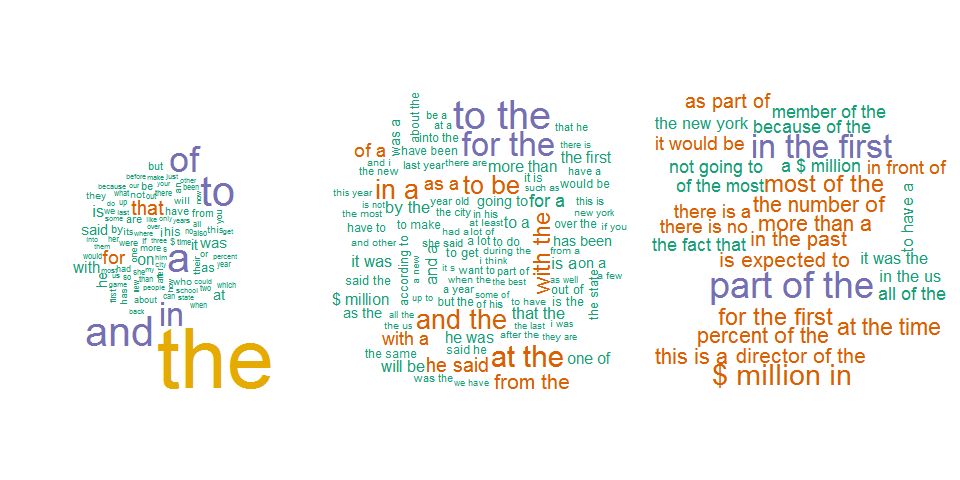

### My course project in the [Data Science Capstone]("https://www.coursera.org/course/dsscapstone")

<h3 align="left">
Course Description
</h3> 

This folder contains my course project submitted through GitHub for the course [Data Science Capstone]("https://www.coursera.org/course/dsscapstone") in Coursera. This is the final course in the Johns Hopkins Data Science Specialization. 

The capstone project give students an opportunity to take all the skills they've learned from the specialization and apply them to a project, starting from the ground up. It begins with a raw data set and finally ending with developing a product for presentation. The Project will be drawn from real-world problems.

<h3 align="left">
Course Requirement
</h3>

First, the student is required to create a Shiny application and deploy it on Rstudio's servers. Second, the student will use Slidify or Rstudio Presenter to prepare a reproducible pitch presentation about the application.

The ultimate goal of the student in the course project is to come up with a shiny app that will demonstrate his models predictive ability to predict the next word in a sentence.However, there are so many concepts and data manipulaition that the student has to go through to reach the end result. Among them is the concept of Natural Language programming.

Natural language processing (NLP) is a field of computer science, artificial intelligence, and computational linguistics concerned with the interactions between computers and human (natural) languages. As such, NLP is related to the area of human-computer interaction. Many challenges in NLP involve: natural language understanding, enabling computers to derive meaning from human or natural language input; and others involve natural language generation. - Wikipedia

[Predicting The Next Word Pitch presentation](http://rpubs.com/DocOfi/194236)

[Predicting the Next Word App](https://docofi.shinyapps.io/ShinyApp16/)

<h3 align="left">
Content
</h3>

This folder contains the following:

- A ReadMe markdown document
- finaltxt.md
- finaltxt_files
- index1.png
- capstone.Rpres
- capstone.md
- logopohjd.png 
- fourfivg.png 
- ui.R 
- server.R 
- helper.R 

*note* The data containing the words or vocabulary from which the prediction model draws from was not included in the repository due to the large size of the file.

The README markdown document is displayed by default by GitHub whenever you visit a GitHub repository. The document you are reading now is the README.md file. It contains information about the content of this repo.

The finaltxt.md document is a markdown document that contains the steps taken to create the vocabulary of words from which the prediction model will draw from to predict the next word in a sentence.

The finaltxt_files is a folder containing the images displayed in the finaltxt markdown document.

The index1.png is an image file in .png format which contains the image displayed in the README markdown document.

The capstone.Rpres file is an RStudios Presenter file which creates the pitch presentation. The pitch presentation can be viewed by clicking on this link [Predicting The Next Word Pitch presentation](http://rpubs.com/DocOfi/194236)

The capstone.md file is the markdown version of the output of the pitch presentation.

The logopohjd.png and the fourfivg.png files are also image files in .png format displayed in the capstone.Rpres markdown document

The .R files contain the codes to create the shiny app presentation. You can view the app by clicking on this link [Predicting the Next Word](https://docofi.shinyapps.io/capstone/)

