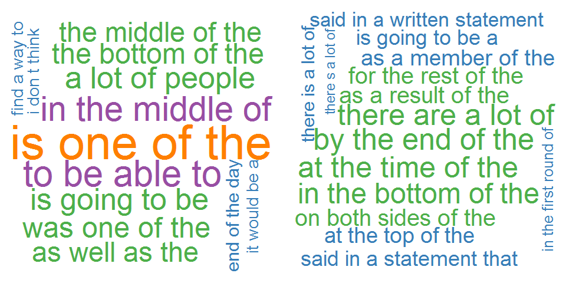

Predicting The Next Word
========================================================
author: Edmund Julian L. Ofilada
date: July 5, 2016
transition: rotate

<small> 
Coordinator  
Project Oral Health 
for Juvenile Diabetics
</small>

Motivation
========================================================
incremental: true
type: prompt

- Tired of reading the same stories in the news???
- Do you ever get that feeling that the same events happen over and over again
- Do you feel like you can predict what tomorrow's HEADLINES are going to be ???
- Try our App and pit your skills in predicting the next word
- 

A brief description
========================================================
incremental: true
type: section

- We obtained a collection of text from news sources and this will form the corpus from which our prediction will be based
- The words were grouped into a sequence of words of varying lengths based on their sequence.
- A longer sequence of words provided better context for predicting the next word
- Some words or group of words occur more frequent than others 

Follow the link
========================================================

The most frequent four word sequence and five word sequence found in our corpus.

***

Follow our link and you will be ask to type a short phrase, keeping the last word to yourself. Click next and our App will predict the next word. Did it match what you had in mind?

See the link on the next page

Link to the App
========================================================

Click on the link below to try our App. A bit of a warning though!!!  Prepare for a belly ache from some of the outrageous words that the App sometimes predict.  Have fun!!!  I did.
 
[Predicting The Next Word]( https://docofi.shinyapps.io/capstone/)

Now if we can only predict blood sugar much better we'd probably see less complications and deaths from diabetes.

