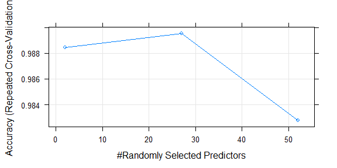

# Predicting Movement
DocOfi  
October 16, 2015  


### Synopsis
The predominant approach to preventing injuries currently is to provide athletes with  a professional trainer who provides real time feedback while observing the execution of certain movement. The objective of this work is to determine whether it will be possible to classify errors during the execution of movement based on data obtained from motion traces recorded using on-body sensors.  We used regression as our tool to create predictive models on the HAR weight lifting exercises dataset. We   classified errors and correct execution of lifting barbells with high accuracy, sensitivity and specificity. 

### Introduction 
Six male participants aged between 20-28 years, were asked to perform one set of 10 repetitions of Unilateral Dumbbell Biceps Curl using a 1.25 dumbbell in different fashions: *exactly according to the specified execution of the exercise* (**Class A**), *throwing the elbows to the front* (**Class B**), *lifting the dumbbell only halfway* (**Class C**), *lowering the dumbbell only halfway* (**Class D**) and *throwing the hips to the front* (**Class E**).  Mounted sensors in the users' glove, armband, lumbar belt and dumbbell collected data  on the Euler angles (roll, pitch and yaw), as well as the raw accelerometer, gyroscope and magnetometer readings.  More information is available from the website [http://groupware.les.inf.puc-rio.br/har](http://groupware.les.inf.puc-rio.br/har).

### Downloading the Data
The data for this project come from this source: [http://groupware.les.inf.puc-rio.br/har](http://groupware.les.inf.puc-rio.br/har).


```r
training_url <- "https://d396qusza40orc.cloudfront.net/predmachlearn/pml-training.csv"
testing_url <- "https://d396qusza40orc.cloudfront.net/predmachlearn/pml-testing.csv"
download.file(training_url, destfile = "training.csv")
download.file(testing_url, destfile = "testing.csv")
dateDownloaded <- date()
dateDownloaded
```

```
## [1] "Wed Mar 23 10:16:36 2016"
```

### Reading and Processing the data 

```r
library(caret)
library(ggplot2)
training <- read.csv("training.csv", header = TRUE, na.strings = c("NA", "#DIV/0!", ""), stringsAsFactors = FALSE)
testing <- read.csv("testing.csv", header = TRUE, na.strings = c("NA", "#DIV/0!", ""), stringsAsFactors = FALSE)
sumVar_index <- grepl("^min|^max|^kurtosis|^skewness|^avg|^var|^stddev|^amplitude", names(training))###identifying summary variables
sumVar <- names(training)[!sumVar_index]
my_df <- training[, sumVar]### removing summary variables
all_na_index <- sapply(my_df, function(x)sum(is.na(x)))
my_df2 <- my_df[, -c(1:7)]### removing housekeeping variables
```

The features of the data may be classified into **measurement, summary, and housekeeping variables**.  The **summary variables** (beginning with: *min, max, kurtosis, skewness, avg, stddev, and amplitude*) apply summary statisitics on the **measurement variables** (beginning with: *roll, pitch, yaw, total, gyros, magnet, and accel*). It would have been preferred to use the summary variables for our model as they immensely reduce the number of observations and processing time and yet contain the gist of the measurement variables. However, it was impossible to make predictions based on the summary variables on the testing dataset as this contain only missing values. We will be removing the **housekeeping variables** that contain the row numbers *(x)*, timestamps (*raw_timestamp_part_1, raw_timestamp_part_2, cvtd_timestamp*), and measurement intervals (*new_window and num_window*).

The downloaded  training dataset contains ``160`` variables and ``19622`` rows while the testing dataset contains ``160`` variables and ``160`` rows.

###Setting the variables to their correct class
We need to set the variables into the correct class to avoid errors.

```r
my_df2$total_accel_belt <- as.numeric(my_df2$total_accel_belt)
my_df2$accel_belt_x <- as.numeric(my_df2$ accel_belt_x)
my_df2$accel_belt_y <- as.numeric(my_df2$accel_belt_y)
my_df2$accel_belt_z <- as.numeric(my_df2$accel_belt_z)
my_df2$magnet_belt_x <- as.numeric(my_df2$magnet_belt_x)
my_df2$magnet_belt_y <- as.numeric(my_df2$magnet_belt_y)
my_df2$magnet_belt_z <- as.numeric(my_df2$magnet_belt_z)
my_df2$total_accel_arm <- as.numeric(my_df2$total_accel_arm)
my_df2$accel_arm_x <- as.numeric(my_df2$accel_arm_x)
my_df2$accel_arm_y <- as.numeric(my_df2$accel_arm_y)
my_df2$accel_arm_z <- as.numeric(my_df2$accel_arm_z)
my_df2$magnet_arm_x <- as.numeric(my_df2$magnet_arm_x)
my_df2$magnet_arm_y <- as.numeric(my_df2$magnet_arm_y)
my_df2$magnet_arm_z <- as.numeric(my_df2$magnet_arm_z)
my_df2$total_accel_dumbbell <- as.numeric(my_df2$total_accel_dumbbell)
my_df2$total_accel_dumbbell <- as.numeric(my_df2$total_accel_dumbbell)
my_df2$accel_dumbbell_x <- as.numeric(my_df2$ accel_dumbbell_x)
my_df2$accel_dumbbell_y <- as.numeric(my_df2$ accel_dumbbell_y)
my_df2$accel_dumbbell_z <- as.numeric(my_df2$ accel_dumbbell_z)
my_df2$magnet_dumbbell_x <- as.numeric(my_df2$ magnet_dumbbell_x)
my_df2$magnet_dumbbell_y <- as.numeric(my_df2$ magnet_dumbbell_y)
my_df2$total_accel_forearm <- as.numeric(my_df2$total_accel_forearm)
my_df2$accel_forearm_x <- as.numeric(my_df2$accel_forearm_x)
my_df2$accel_forearm_y <- as.numeric(my_df2$accel_forearm_y)
my_df2$accel_forearm_z <- as.numeric(my_df2$accel_forearm_z)
my_df2$magnet_forearm_x <- as.numeric(my_df2$magnet_forearm_x)
my_df2$classe <- as.factor(my_df2$classe)
###Checking for variables that contain only zeroes
all_zero_index <- sapply(my_df2[,-53], sum)
all_zero_vars <- which(all_zero_index == 0)
```

### Creating a Train set and a Validation set

We partition the data into a train set and a validation set. A testing set was provided and downloaded earlier.

```r
library(caret)
set.seed(107)
intrain <- createDataPartition(y = my_df2$classe, p = 0.6, list = FALSE)
train_set <- my_df2[intrain, ]
validation_set <- my_df2[-intrain, ]
```

The final training dataset contains ``53`` variables and ``11776`` rows.

###Model Creation
We generate a random forest model on the training dataset using the caret and rf package. The variable classe will be our dependent variable. It contains the classification of whether the movement was performed correctly or not and what error was commited as discussed earlier.We included a 5-fold cross validation to improve our model repeated twice.


```r
ctrl <- trainControl(method="repeatedcv", number=5, repeats=2)
rfor_fitall = train(classe ~ ., data=train_set, method="rf", trControl=ctrl)
```

###Assessing Model Accuracy
We examine the model for its accuracy. 

```r
library(knitr)
print(kable(rfor_fitall$results))
```


 mtry    Accuracy       Kappa   AccuracySD     KappaSD
-----  ----------  ----------  -----------  ----------
    2   0.9884510   0.9853898    0.0022903   0.0028972
   27   0.9895546   0.9867866    0.0025199   0.0031864
   52   0.9827615   0.9781883    0.0023100   0.0029253


```r
pred_Trainingset <- predict(rfor_fitall, newdata = train_set)
pred_Vset <- predict(rfor_fitall, newdata = validation_set)
In_SampleErr <- table(pred_Trainingset,train_set$classe)
out_of_SampleErr <- table(pred_Vset, validation_set$classe)
Model_accuracy <- confusionMatrix(pred_Vset, validation_set$classe)
```

The table below shows which predictions on the training dataset and the validation dataset were correct and which were not. The non-diagonal elements are the errors. We can see that our model was able to predict on the training dataset perfectly, which maybe a cause for worry with regard to overfitting.  


```r
print(kable(In_SampleErr))
```

         A      B      C      D      E
---  -----  -----  -----  -----  -----
A     3348      0      0      0      0
B        0   2279      0      0      0
C        0      0   2054      0      0
D        0      0      0   1930      0
E        0      0      0      0   2165

The prediction on the validation dataset was 99% accurate. it misclassified only 59 out of a possible 7,846 entries.


```r
print(kable(out_of_SampleErr))
```

         A      B      C      D      E
---  -----  -----  -----  -----  -----
A     2228      7      0      0      0
B        1   1506     12      1      0
C        2      5   1350     16      3
D        0      0      6   1268      4
E        1      0      0      1   1435

The confusion matrix summarize the accuracy, sensitivity, specificity, and other parameters of our model.


```r
print(kable(Model_accuracy$byClass))
```

            Sensitivity   Specificity   Pos Pred Value   Neg Pred Value   Prevalence   Detection Rate   Detection Prevalence   Balanced Accuracy
---------  ------------  ------------  ---------------  ---------------  -----------  ---------------  ---------------------  ------------------
Class: A      0.9982079     0.9987531        0.9968680        0.9992871    0.2844762        0.2839664              0.2848585           0.9984805
Class: B      0.9920949     0.9977876        0.9907895        0.9981031    0.1934744        0.1919449              0.1937293           0.9949412
Class: C      0.9868421     0.9959864        0.9811047        0.9972179    0.1743564        0.1720622              0.1753760           0.9914143
Class: D      0.9860031     0.9984756        0.9921753        0.9972594    0.1639052        0.1616110              0.1628855           0.9922394
Class: E      0.9951456     0.9996877        0.9986082        0.9989078    0.1837879        0.1828957              0.1831507           0.9974167

The plot shows the relationship between the number of randomly selected predictors and the accuracy. Accuracy is highest when mtry, the number of variables available for splitting at each tree node is 27. mtry is the tuning parameter for the package rf in caret.


```r
plot(rfor_fitall)
```



###Conclusions

Predictive models on the HAR weight lifting exercises dataset   classified errors and correct execution of lifting barbells with high accuracy, sensitivity and specificity.  

###Predicting on the Test Set
We now use our model to predict on the downloaded test set 


```r
testing_proc <- testing[ , which(names(testing) %in% names(train_set))]
pred_Testset <- predict(rfor_fitall, newdata = testing)
print(pred_Testset)
```

 [1] B A B A A E D B A A B C B A E E A B B B
Levels: A B C D E


```r
sessionInfo()
```

```
## R version 3.2.4 (2016-03-10)
## Platform: i386-w64-mingw32/i386 (32-bit)
## Running under: Windows 10 (build 10586)
## 
## locale:
## [1] LC_COLLATE=English_United States.1252 
## [2] LC_CTYPE=English_United States.1252   
## [3] LC_MONETARY=English_United States.1252
## [4] LC_NUMERIC=C                          
## [5] LC_TIME=English_United States.1252    
## 
## attached base packages:
## [1] stats     graphics  grDevices utils     datasets  methods   base     
## 
## other attached packages:
## [1] knitr_1.12.3        randomForest_4.6-12 caret_6.0-64       
## [4] ggplot2_2.1.0       lattice_0.20-33    
## 
## loaded via a namespace (and not attached):
##  [1] codetools_0.2-14   digest_0.6.9       htmltools_0.3     
##  [4] minqa_1.2.4        splines_3.2.4      MatrixModels_0.4-1
##  [7] scales_0.3.0       grid_3.2.4         stringr_1.0.0     
## [10] e1071_1.6-7        lme4_1.1-11        munsell_0.4.3     
## [13] highr_0.5.1        compiler_3.2.4     nnet_7.3-12       
## [16] foreach_1.4.3      iterators_1.0.8    mgcv_1.8-12       
## [19] Matrix_1.2-4       MASS_7.3-45        plyr_1.8.3        
## [22] stats4_3.2.4       stringi_1.0-1      pbkrtest_0.4-6    
## [25] magrittr_1.5       car_2.1-1          reshape2_1.4.1    
## [28] rmarkdown_0.9.5    evaluate_0.8.3     gtable_0.2.0      
## [31] colorspace_1.2-6   yaml_2.1.13        tools_3.2.4       
## [34] parallel_3.2.4     nloptr_1.0.4       nlme_3.1-126      
## [37] quantreg_5.21      class_7.3-14       formatR_1.3       
## [40] Rcpp_0.12.3        SparseM_1.7
```
