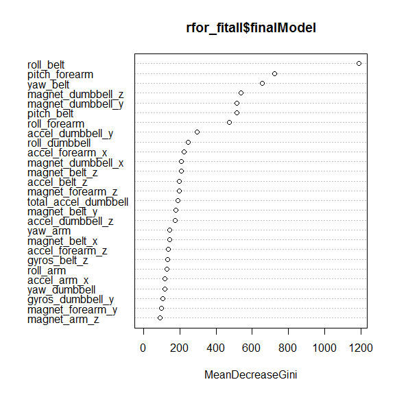

# Predicting Movement
DocOfi  
October 16, 2015  


### Synopsis
The predominant approach to preventing injuries currently is to provide athletes with  a professional trainer who provides real time feedback while observing the execution of certain exercises. The objective of this work is to determine whether it will be possible to classify errors during the execution of movement based on data obtained from motion traces recorded using on-body sensors.  We used regression as our tool to create predictive models on the HAR weight lifting exercises dataset. We   classified errors and correct execution of lifting barbells with high accuracy, sensitivity and specificity. 

### Introduction 
Six male participants aged between 20-28 years, were asked to perform one set of 10 repetitions of Unilateral Dumbbell Biceps Curl using a 1.25 dumbbell in different fashions: *exactly according to the specified execution of the exercise* (**Class A**), *throwing the elbows to the front* (**Class B**), *lifting the dumbbell only halfway* (**Class C**), *lowering the dumbbell only halfway* (**Class D**) and *throwing the hips to the front* (**Class E**).  Mounted sensors in the users' glove, armband, lumbar belt and dumbbell collected data  on the Euler angles (roll, pitch and yaw), as well as the raw accelerometer, gyroscope and magnetometer readings.  More information is available from the website [http://groupware.les.inf.puc-rio.br/har](http://groupware.les.inf.puc-rio.br/har).

### Downloading the Data
The data for this project come from this source: [http://groupware.les.inf.puc-rio.br/har](http://groupware.les.inf.puc-rio.br/har).


```r
training_url <- "https://d396qusza40orc.cloudfront.net/predmachlearn/pml-training.csv"
testing_url <- "https://d396qusza40orc.cloudfront.net/predmachlearn/pml-testing.csv"
download.file(training_url, destfile = "training.csv")
download.file(testing_url, destfile = "testing.csv")
dateDownloaded <- date()
dateDownloaded
```

```
## [1] "Wed Mar 23 10:16:36 2016"
```

### Reading and Processing the data 

```r
library(caret)
library(ggplot2)
training <- read.csv("training.csv", header = TRUE, na.strings = c("NA", "#DIV/0!", ""), stringsAsFactors = FALSE)
testing <- read.csv("testing.csv", header = TRUE, na.strings = c("NA", "#DIV/0!", ""), stringsAsFactors = FALSE)
sumVar_index <- grepl("^min|^max|^kurtosis|^skewness|^avg|^var|^stddev|^amplitude", names(training))###identifying summary variables
sumVar <- names(training)[!sumVar_index]
my_df <- training[, sumVar]### removing summary variables
all_na_index <- sapply(my_df, function(x)sum(is.na(x)))
my_df2 <- my_df[, -c(1:7)]### removing housekeeping variables
```

The features of the data may be classified into **measurement, summary, and housekeeping variables**.  The **summary variables** (beginning with: *min, max, kurtosis, skewness, avg, stddev, and amplitude*) apply summary statisitics on the **measurement variables** (beginning with: *roll, pitch, yaw, total, gyros, magnet, and accel*). It would have been preferred to use the summary variables for our model as they immensely reduce the number of observations and processing time and yet contain the gist of the measurement variables. However, it was impossible to make predictions based on the summary variables on the testing dataset as this contain only missing values. We will be removing the **housekeeping variables** that contain the row numbers *(x)*, timestamps (*raw_timestamp_part_1, raw_timestamp_part_2, cvtd_timestamp*), and measurement intervals (*new_window and num_window*).

The downloaded  training dataset contains ``160`` variables and ``19622`` rows while the testing dataset contains ``160`` variables and ``160`` rows.

###Setting the variables to their correct class
We need to set the variables into the correct class to avoid errors.

```r
my_df2$total_accel_belt <- as.numeric(my_df2$total_accel_belt)
my_df2$accel_belt_x <- as.numeric(my_df2$ accel_belt_x)
my_df2$accel_belt_y <- as.numeric(my_df2$accel_belt_y)
my_df2$accel_belt_z <- as.numeric(my_df2$accel_belt_z)
my_df2$magnet_belt_x <- as.numeric(my_df2$magnet_belt_x)
my_df2$magnet_belt_y <- as.numeric(my_df2$magnet_belt_y)
my_df2$magnet_belt_z <- as.numeric(my_df2$magnet_belt_z)
my_df2$total_accel_arm <- as.numeric(my_df2$total_accel_arm)
my_df2$accel_arm_x <- as.numeric(my_df2$accel_arm_x)
my_df2$accel_arm_y <- as.numeric(my_df2$accel_arm_y)
my_df2$accel_arm_z <- as.numeric(my_df2$accel_arm_z)
my_df2$magnet_arm_x <- as.numeric(my_df2$magnet_arm_x)
my_df2$magnet_arm_y <- as.numeric(my_df2$magnet_arm_y)
my_df2$magnet_arm_z <- as.numeric(my_df2$magnet_arm_z)
my_df2$total_accel_dumbbell <- as.numeric(my_df2$total_accel_dumbbell)
my_df2$total_accel_dumbbell <- as.numeric(my_df2$total_accel_dumbbell)
my_df2$accel_dumbbell_x <- as.numeric(my_df2$ accel_dumbbell_x)
my_df2$accel_dumbbell_y <- as.numeric(my_df2$ accel_dumbbell_y)
my_df2$accel_dumbbell_z <- as.numeric(my_df2$ accel_dumbbell_z)
my_df2$magnet_dumbbell_x <- as.numeric(my_df2$ magnet_dumbbell_x)
my_df2$magnet_dumbbell_y <- as.numeric(my_df2$ magnet_dumbbell_y)
my_df2$total_accel_forearm <- as.numeric(my_df2$total_accel_forearm)
my_df2$accel_forearm_x <- as.numeric(my_df2$accel_forearm_x)
my_df2$accel_forearm_y <- as.numeric(my_df2$accel_forearm_y)
my_df2$accel_forearm_z <- as.numeric(my_df2$accel_forearm_z)
my_df2$magnet_forearm_x <- as.numeric(my_df2$magnet_forearm_x)
my_df2$classe <- as.factor(my_df2$classe)
###Checking for variables that contain only zeroes
all_zero_index <- sapply(my_df2[,-53], sum)
all_zero_vars <- which(all_zero_index == 0)
```

### Creating a Train set and a Validation set

We partition the data into a train set and two test sets with 60, 20, and 20 percent composition. A testing set was downloaded earlier as a final validation of the model's accuracy.

```r
library(caret)
set.seed(107)
intrain <- createDataPartition(y = my_df2$classe, p = 0.6, list = FALSE)
train_set <- my_df2[intrain, ]
validation_set <- my_df2[-intrain, ]
intrain2 <- createDataPartition(y = validation_set$classe, p = 0.75, list = FALSE)
test_set1 <- validation_set[intrain2, ]
test_set2 <- validation_set[-intrain2, ]
```

The final training dataset contains ``53`` variables and ``11776`` rows. The first test set has ``53`` variables and ``5886`` rows. The second test set has ``53`` variables and ``1960`` rows.

###Model Creation
We generate a random forest model on the training dataset using the caret and rf package. The variable classe will be our dependent variable. It contains the classification of whether the movement was performed correctly or not and what error was commited as discussed earlier.We included a 5-fold cross validation to improve our model repeated twice.


```r
ctrl <- trainControl(method="repeatedcv", number=5, repeats=2)
rfor_fitall = train(classe ~ ., data=train_set, method="rf", trControl=ctrl)
```

###Assessing Model Accuracy
We examine the model for its accuracy and we finid it to be very accurate.

```r
library(knitr)
print(kable(rfor_fitall$results))
```


 mtry    Accuracy       Kappa   AccuracySD     KappaSD
-----  ----------  ----------  -----------  ----------
    2   0.9884510   0.9853898    0.0022903   0.0028972
   27   0.9895546   0.9867866    0.0025199   0.0031864
   52   0.9827615   0.9781883    0.0023100   0.0029253


```r
pred_Trainingset <- predict(rfor_fitall, newdata = train_set)
pred_Vset <- predict(rfor_fitall, newdata = test_set1)
In_SampleErr <- table(pred_Trainingset,train_set$classe)
out_of_SampleErr <- table(pred_Vset, test_set1$classe)
Model_accuracy <- confusionMatrix(pred_Vset, test_set1$classe)
```

The table below shows which predictions on the training dataset and the validation dataset were correct and which were not. The non-diagonal elements are the errors. We can see that our model was able to predict on the training dataset perfectly, which maybe a cause for worry with regard to overfitting.  


```r
print(kable(In_SampleErr))
```

         A      B      C      D      E
---  -----  -----  -----  -----  -----
A     3348      0      0      0      0
B        0   2279      0      0      0
C        0      0   2054      0      0
D        0      0      0   1930      0
E        0      0      0      0   2165

The prediction on the the first test dataset was 99% accurate. it misclassified only 40 out of a possible 5,886 entries.


```r
print(kable(out_of_SampleErr))
```

         A      B      C     D      E
---  -----  -----  -----  ----  -----
A     1672      5      0     0      0
B        1   1130      9     0      0
C        1      4   1013     9      3
D        0      0      4   955      3
E        0      0      0     1   1076

The confusion matrix summarize the accuracy, sensitivity, specificity, and other parameters of our model.


```r
print(kable(Model_accuracy$byClass))
```

            Sensitivity   Specificity   Pos Pred Value   Neg Pred Value   Prevalence   Detection Rate   Detection Prevalence   Balanced Accuracy
---------  ------------  ------------  ---------------  ---------------  -----------  ---------------  ---------------------  ------------------
Class: A      0.9988053     0.9988129        0.9970185        0.9995248    0.2844037        0.2840639              0.2849134           0.9988091
Class: B      0.9920983     0.9978934        0.9912281        0.9981037    0.1935100        0.1919810              0.1936799           0.9949959
Class: C      0.9873294     0.9965021        0.9834951        0.9973229    0.1743119        0.1721033              0.1749915           0.9919157
Class: D      0.9896373     0.9985775        0.9927235        0.9979691    0.1639484        0.1622494              0.1634387           0.9941074
Class: E      0.9944547     0.9997918        0.9990715        0.9987523    0.1838260        0.1828067              0.1829766           0.9971233

The plot below shows the relationship between the number of randomly selected predictors and the accuracy. Accuracy is highest when mtry, the number of variables available for splitting at each tree node is 27. mtry is the tuning parameter for the package rf in caret.


```r
plot(rfor_fitall)
```


###Reducing the Number of Features
We now check which features are important for our model to reduce the number of features in our model to improve the processing time of our model and improve scalability and interpretability.

```r
varImpPlot(rfor_fitall$finalModel, n.var = 27)
```



We compare the more important features to those which are highly correlated and decide which features to keep.

###Identifying Variables with High Correlation

```r
cor_mat <- cor(train_set[,-53])
Cor_Sum <- summary(cor_mat[upper.tri(cor_mat)])
highcor <- findCorrelation(cor_mat, cutoff = .75)
highcor_Vars <-  as.data.frame(names(train_set)[highcor])
highcor_Vars
```

   names(train_set)[highcor]
1               accel_belt_z
2                  roll_belt
3               accel_belt_y
4                accel_arm_y
5           total_accel_belt
6           accel_dumbbell_z
7               accel_belt_x
8                 pitch_belt
9          magnet_dumbbell_x
10          accel_dumbbell_y
11         magnet_dumbbell_y
12          accel_dumbbell_x
13               accel_arm_x
14               accel_arm_z
15              magnet_arm_y
16             magnet_belt_z
17           accel_forearm_y
18               gyros_arm_x

**Can  we do just as well with 20 features?**


```r
ctrl <- trainControl(method="repeatedcv", number=5, repeats=2)
rfor_fit20 = train(classe ~ yaw_belt + pitch_forearm + magnet_dumbbell_z + pitch_belt + magnet_belt_y + gyros_belt_z + magnet_belt_x + gyros_arm_y + gyros_dumbbell_y + yaw_arm + accel_belt_z + accel_dumbbell_z + accel_dumbbell_y + gyros_forearm_y + accel_forearm_x + gyros_belt_x + magnet_arm_z + gyros_dumbbell_z + magnet_belt_z + magnet_dumbbell_y, data=train_set, method="rf", trControl=ctrl)
```


```r
pred_Vset20 <- predict(rfor_fit20, newdata = test_set1)
Model_accuracy20 <- confusionMatrix(pred_Vset20, test_set1$classe)
print(kable(Model_accuracy$byClass))
```

            Sensitivity   Specificity   Pos Pred Value   Neg Pred Value   Prevalence   Detection Rate   Detection Prevalence   Balanced Accuracy
---------  ------------  ------------  ---------------  ---------------  -----------  ---------------  ---------------------  ------------------
Class: A      0.9988053     0.9988129        0.9970185        0.9995248    0.2844037        0.2840639              0.2849134           0.9988091
Class: B      0.9920983     0.9978934        0.9912281        0.9981037    0.1935100        0.1919810              0.1936799           0.9949959
Class: C      0.9873294     0.9965021        0.9834951        0.9973229    0.1743119        0.1721033              0.1749915           0.9919157
Class: D      0.9896373     0.9985775        0.9927235        0.9979691    0.1639484        0.1622494              0.1634387           0.9941074
Class: E      0.9944547     0.9997918        0.9990715        0.9987523    0.1838260        0.1828067              0.1829766           0.9971233

```r
print(kable(Model_accuracy20$byClass))
```

            Sensitivity   Specificity   Pos Pred Value   Neg Pred Value   Prevalence   Detection Rate   Detection Prevalence   Balanced Accuracy
---------  ------------  ------------  ---------------  ---------------  -----------  ---------------  ---------------------  ------------------
Class: A      0.9970131     0.9983381        0.9958234        0.9988124    0.2844037        0.2835542              0.2847435           0.9976756
Class: B      0.9903424     0.9972614        0.9886065        0.9976818    0.1935100        0.1916412              0.1938498           0.9938019
Class: C      0.9853801     0.9956790        0.9796512        0.9969098    0.1743119        0.1717635              0.1753313           0.9905296
Class: D      0.9844560     0.9985775        0.9926855        0.9969568    0.1639484        0.1613999              0.1625892           0.9915167
Class: E      0.9972274     0.9997918        0.9990741        0.9993758    0.1838260        0.1833163              0.1834862           0.9985096

**we achieved the same accuracy,sensitivity, and specificity with fewer features.  We probably can reduce it some more**.

**Let's try a model with 8 features**

```r
ctrl <- trainControl(method="repeatedcv", number=5, repeats=2)
rfor_fit8 = train(classe ~ yaw_belt + pitch_forearm + magnet_dumbbell_z + pitch_belt + magnet_dumbbell_y + gyros_belt_z + magnet_belt_x + yaw_arm, data=train_set, method="rf", trControl=ctrl)
```

**The results were still impressive. If you recall the plot above, 2 randomly selected predictors was able to achieve a slightly lower accuracy compared to one with 27**.

```r
pred_testset8 <- predict(rfor_fit8, newdata = test_set1)
Model_accuracy8 <- confusionMatrix(pred_testset8, test_set1$classe)
print(kable(Model_accuracy8$byClass))
```

            Sensitivity   Specificity   Pos Pred Value   Neg Pred Value   Prevalence   Detection Rate   Detection Prevalence   Balanced Accuracy
---------  ------------  ------------  ---------------  ---------------  -----------  ---------------  ---------------------  ------------------
Class: A      0.9946237     0.9962013        0.9904819        0.9978597    0.2844037        0.2828746              0.2855929           0.9954125
Class: B      0.9640035     0.9962081        0.9838710        0.9914046    0.1935100        0.1865443              0.1896024           0.9801058
Class: C      0.9853801     0.9919753        0.9628571        0.9968983    0.1743119        0.1717635              0.1783894           0.9886777
Class: D      0.9844560     0.9977647        0.9885536        0.9969543    0.1639484        0.1613999              0.1632688           0.9911103
Class: E      0.9926063     0.9991674        0.9962894        0.9983361    0.1838260        0.1824669              0.1831464           0.9958868

**Let's try a model with 4 features**.

```r
rfor_fit4 = train(classe ~ yaw_belt + pitch_forearm + magnet_dumbbell_z + yaw_arm, data=train_set, method="rf", trControl=ctrl)
```


```r
pred_testset4 <- predict(rfor_fit4, newdata = test_set1)
Model_accuracy4 <- confusionMatrix(pred_testset4, test_set1$classe)
print(kable(Model_accuracy4$byClass))
```

            Sensitivity   Specificity   Pos Pred Value   Neg Pred Value   Prevalence   Detection Rate   Detection Prevalence   Balanced Accuracy
---------  ------------  ------------  ---------------  ---------------  -----------  ---------------  ---------------------  ------------------
Class: A      0.9701314     0.9883666        0.9707113        0.9881320    0.2844037        0.2759089              0.2842338           0.9792490
Class: B      0.8867428     0.9770381        0.9025916        0.9729390    0.1935100        0.1715936              0.1901121           0.9318904
Class: C      0.8888889     0.9779835        0.8949951        0.9765769    0.1743119        0.1549439              0.1731227           0.9334362
Class: D      0.9295337     0.9782565        0.8934263        0.9860713    0.1639484        0.1523955              0.1705742           0.9538951
Class: E      0.9584104     0.9929226        0.9682540        0.9906542    0.1838260        0.1761808              0.1819572           0.9756665

**Specificity and sensitivity dipped a bit but a model with 4 features has better interpretability, scalability and faster processing**.

###Predicting on the second Test Set
**we now compare the model with all the variables and the one with 4 only on the second test set.**

```r
print(kable(Model_accuracy$byClass))
```

            Sensitivity   Specificity   Pos Pred Value   Neg Pred Value   Prevalence   Detection Rate   Detection Prevalence   Balanced Accuracy
---------  ------------  ------------  ---------------  ---------------  -----------  ---------------  ---------------------  ------------------
Class: A      0.9988053     0.9988129        0.9970185        0.9995248    0.2844037        0.2840639              0.2849134           0.9988091
Class: B      0.9920983     0.9978934        0.9912281        0.9981037    0.1935100        0.1919810              0.1936799           0.9949959
Class: C      0.9873294     0.9965021        0.9834951        0.9973229    0.1743119        0.1721033              0.1749915           0.9919157
Class: D      0.9896373     0.9985775        0.9927235        0.9979691    0.1639484        0.1622494              0.1634387           0.9941074
Class: E      0.9944547     0.9997918        0.9990715        0.9987523    0.1838260        0.1828067              0.1829766           0.9971233

```r
print(kable(Model_accuracy4$byClass))
```

            Sensitivity   Specificity   Pos Pred Value   Neg Pred Value   Prevalence   Detection Rate   Detection Prevalence   Balanced Accuracy
---------  ------------  ------------  ---------------  ---------------  -----------  ---------------  ---------------------  ------------------
Class: A      0.9701314     0.9883666        0.9707113        0.9881320    0.2844037        0.2759089              0.2842338           0.9792490
Class: B      0.8867428     0.9770381        0.9025916        0.9729390    0.1935100        0.1715936              0.1901121           0.9318904
Class: C      0.8888889     0.9779835        0.8949951        0.9765769    0.1743119        0.1549439              0.1731227           0.9334362
Class: D      0.9295337     0.9782565        0.8934263        0.9860713    0.1639484        0.1523955              0.1705742           0.9538951
Class: E      0.9584104     0.9929226        0.9682540        0.9906542    0.1838260        0.1761808              0.1819572           0.9756665
**Sensitivity suffered a bit but Specificity is still up there.**

###Conclusions

Predictive models on the HAR weight lifting exercises dataset   classified errors and correct execution of lifting barbells with high accuracy, sensitivity and specificity. It has to be pointed out however, that the errors in movement were performed purposefully.  Different results may be obtained when the errors are committed without intent to commit the error.  

###Predicting on the Test Set
We now use our different models to predict on the downloaded test set.  The results are the same for all models. 


```r
testing_proc <- testing[ , which(names(testing) %in% names(train_set))]
pred_Testset <- predict(rfor_fitall, newdata = testing)
print(pred_Testset)
```

 [1] B A B A A E D B A A B C B A E E A B B B
Levels: A B C D E

```r
pred_Testset20 <- predict(rfor_fit20, newdata = testing)
print(pred_Testset20)
```

 [1] B A B A A E D B A A B C B A E E A B B B
Levels: A B C D E

```r
pred_Testset8 <- predict(rfor_fit8, newdata = testing)
print(pred_Testset8)
```

 [1] B A B A A E D B A A B C B A E E A B B B
Levels: A B C D E

```r
pred_Testset4 <- predict(rfor_fit4, newdata = testing)
print(pred_Testset8)
```

 [1] B A B A A E D B A A B C B A E E A B B B
Levels: A B C D E


```r
sessionInfo()
```

```
## R version 3.2.4 (2016-03-10)
## Platform: i386-w64-mingw32/i386 (32-bit)
## Running under: Windows 10 (build 10586)
## 
## locale:
## [1] LC_COLLATE=English_United States.1252 
## [2] LC_CTYPE=English_United States.1252   
## [3] LC_MONETARY=English_United States.1252
## [4] LC_NUMERIC=C                          
## [5] LC_TIME=English_United States.1252    
## 
## attached base packages:
## [1] stats     graphics  grDevices utils     datasets  methods   base     
## 
## other attached packages:
## [1] randomForest_4.6-12 knitr_1.12.3        caret_6.0-64       
## [4] ggplot2_2.1.0       lattice_0.20-33    
## 
## loaded via a namespace (and not attached):
##  [1] codetools_0.2-14   digest_0.6.9       htmltools_0.3     
##  [4] minqa_1.2.4        splines_3.2.4      MatrixModels_0.4-1
##  [7] scales_0.3.0       grid_3.2.4         stringr_1.0.0     
## [10] e1071_1.6-7        lme4_1.1-11        munsell_0.4.3     
## [13] highr_0.5.1        nnet_7.3-12        foreach_1.4.3     
## [16] iterators_1.0.8    mgcv_1.8-12        Matrix_1.2-4      
## [19] MASS_7.3-45        plyr_1.8.3         stats4_3.2.4      
## [22] stringi_1.0-1      pbkrtest_0.4-6     magrittr_1.5      
## [25] car_2.1-1          reshape2_1.4.1     rmarkdown_0.9.5   
## [28] evaluate_0.8.3     gtable_0.2.0       colorspace_1.2-6  
## [31] yaml_2.1.13        tools_3.2.4        parallel_3.2.4    
## [34] nloptr_1.0.4       nlme_3.1-126       quantreg_5.21     
## [37] class_7.3-14       formatR_1.3        Rcpp_0.12.3       
## [40] SparseM_1.7
```
