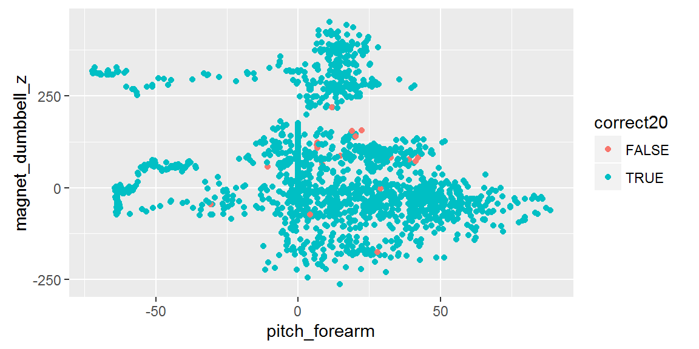
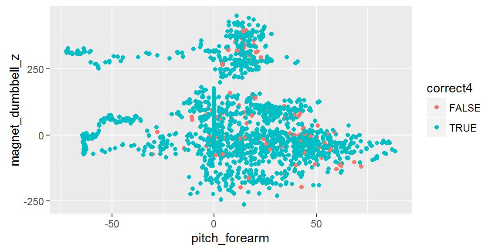

### My course project in the [Practical Machine Learning]("https://www.coursera.org/course/predmachlearn")

#### Course Description

This repository contains my course project submitted through GitHub for the course [Practical Machine Learning]("https://www.coursera.org/course/predmachlearn") in Coursera. This is the eigth course in the Johns Hopkins Data Science Specialization. The course covers the basic components of building and applying prediction functions with an emphasis on practical applications. The course provides basic grounding in concepts such as training and tests sets, overfitting, and error rates and will also introduce a range of model based and algorithmic machine learning methods including regression, classification trees, Naive Bayes, and random forests. The course also covers the complete process of building prediction functions including data collection, feature creation, algorithms, and evaluation.
 
#### Introduction

Six male participants aged between 20-28 years, were asked to perform one set of 10 repetitions of Unilateral Dumbbell Biceps Curl using a 1.25 dumbbell in different fashions: *exactly according to the specified execution of the exercise* (**Class A**), *throwing the elbows to the front* (**Class B**), *lifting the dumbbell only halfway* (**Class C**), *lowering the dumbbell only halfway* (**Class D**) and *throwing the hips to the front* (**Class E**).  Mounted sensors in the users' glove, armband, lumbar belt and dumbbell collected data  on the Euler angles (roll, pitch and yaw), as well as the raw accelerometer, gyroscope and magnetometer readings. 

The goal of the project is to predict the manner in which the participants did the exercise using the variables collected using the sensors..

#### Data

The parameters used for the Human Activity Recognition Using Smartphones Dataset can be read in part in the codeBook and in greater detail at this webiste http://archive.ics.uci.edu/ml/datasets/Human+Activity+Recognition+Using+Smartphones.

The data for this project come from this source: [http://groupware.les.inf.puc-rio.br/har](http://groupware.les.inf.puc-rio.br/har).

### Content 

This Repo contains the following:

- A ReadMe markdown document
- A ReadMe html document
- index1.png
- index2.png
- index3.png
- A index Rmarkdown document
- A index markdown document
- A index html document

The README markdown document is displayed by default by GitHub whenever you visit a GitHub repository. The document you are reading now is the README.md file. It Tcontains information about the content of this repo.

The README. html document is the html version of the README.md document.

The .png files are images that are displayed in the README.md and README.Rmd documents

The index Rmarkdown document contains my project for the Practical Machine Learning Course. 

The index.md and index.html files are versions of the index.Rmd file in markdown and html format. If you want to view my project you can click on the index.md file to display it on the screen. 

