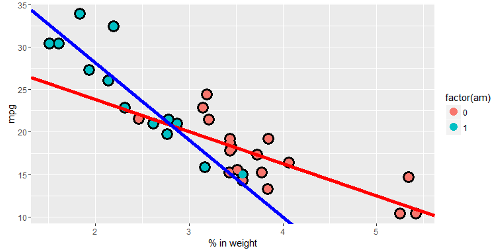

### My course project in the [Regression Models]("https://www.coursera.org/course/regmods")

<h3 align="left">
Course Description
</h3> 

This repository contains my course project submitted through GitHub for the course [Regression Models]("https://www.coursera.org/course/regmods") in Coursera. This is the seventh course in the Johns Hopkins Data Science Specialization. The Regression Models Course give students an opportunity to use regression models, the most important statistical analysis tool in the data scientist's toolkit. 

This course covers regression analysis, least squares and inference using regression models. Special cases of the regression model, ANOVA and ANCOVA was covered as well, including analysis of residuals and variability. The course covers modern thinking on model selection and novel uses of regression models including scatterplot smoothing.

<h3 align="left">
Course Requirement
</h3>

The student is required to take the mtcars data set and write up an analysis to answer a question using regression models and exploratory data analyses. The report must be written as a PDF document compiled (using knitr) R markdown document.

<h3 align="left">
Content
</h3>

This Repo contains the following:

- A ReadMe markdown document
- RegM21a.pdf

The README markdown document is displayed by default by GitHub whenever you visit a GitHub repository. The document you are reading now is the README.md file. It contains information about the content of this repo.

The RegM21a.pdf document contains the final report of my course project.

To download the content of this repository as a .zip file, click on the Download ZIP button. If you have a GitHub account, you can fork the content so you'll have a copy on your GitHub account.  
