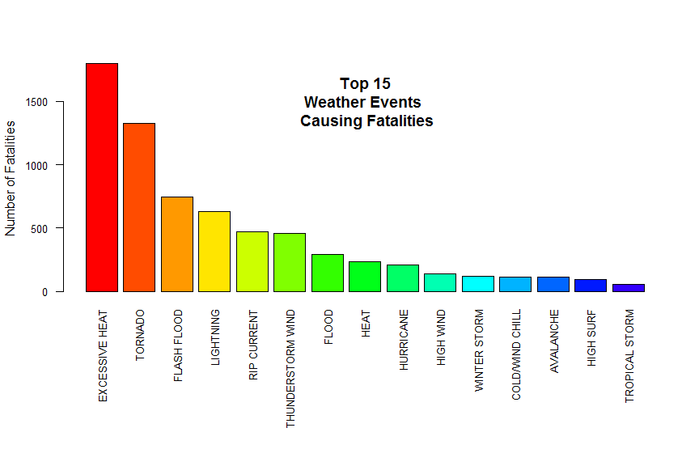
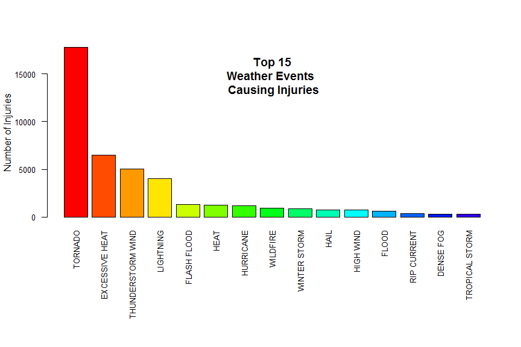
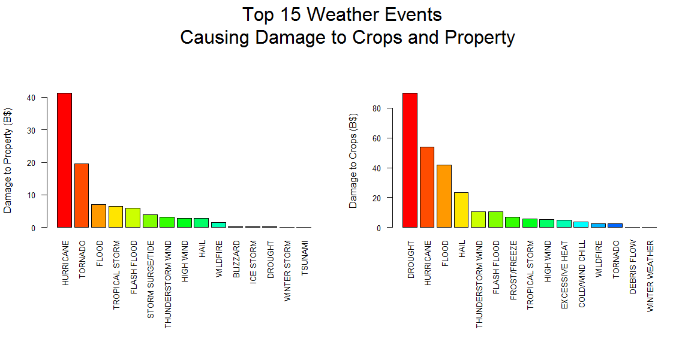

## Synopsis

Over 40 weather events are monitored by the [National Oceanic and Atmospheric Administration (NOAA)](http://www.noaa.gov/). An analysis of this data from 1996 to 2011 reveal that excessive heat, tornadoes, and flash floods are the top three causes of fatalities while tornadoes, excessive heat and thunderstorm wind are the top three causes of injuries among weather events in the United States.

Hurricanes, tornadoes, and floods lead the pack in terms of total cost from damage to property while drought, hurricane, and flood top the list in terms of total cost from damage to crops.

Analysis of this data will be useful to formulate disaster risk reduction strategies to lessen the impact of these weather events. With the advent of climate change, there is an even greater need to improve the ability to forecast which communities are going to be hit the hardest and create mitigating solutions to safeguard lives, property and food security.

##Data Processing

###Loading the Data

The data for this assignment come in the form of a comma-separated-value file compressed via the bzip2
algorithm to reduce its size. You can download the file from the course web site: [Storm Data](https://d396qusza40orc.cloudfront.net/repdata%2Fdata%2FStormData.csv.bz2)[47Mb]


```r
fileurl <- "http://d396qusza40orc.cloudfront.net/repdata%2Fdata%2FStormData.csv.bz2"
download.file(fileurl, destfile = "./data/storm.csv.bz2")
```

```r
dateDownloaded <- date()
print(dateDownloaded)
```

```
## [1] "Wed Oct 28 12:56:36 2015"
```

```r
clc <- c("NULL", "character", "NULL", "NULL", "NULL", "NULL", "NULL", "character", "NULL", "NULL", "NULL", "NULL", "NULL", "NULL", "NULL", "NULL", "NULL", "NULL","NULL", "NULL", "NULL", "NULL", "numeric", "numeric","numeric", "character", "numeric", "character", "NULL", "NULL", "NULL", "NULL", "NULL", "NULL", "NULL", "character", "numeric")
stormdt <- bzfile("./data/storm.csv.bz2", open = "rt")
stormdata <- read.csv(stormdt, header = TRUE, nrows = 653641, sep = ",", colClasses = clc, skip = 251830)
colnames(stormdata) <- c("BGN_DATE", "EVTYPE", "FATALITIES", "INJURIES", "PROPDMG", "PROPDMGEXP", "CROPDMG", "CROPDMGEXP", "REMARKS", "REFNUM")
```


```r
str(stormdata)
```

```
## 'data.frame':	653641 obs. of  10 variables:
##  $ BGN_DATE  : chr  "11/9/1994 0:00:00" "11/10/1994 0:00:00" "11/10/1994 0:00:00" "11/10/1994 0:00:00" ...
##  $ EVTYPE    : chr  "URBAN FLOODS" "THUNDERSTORM WINDS" "URBAN FLOODS" "FLASH FLOODS" ...
##  $ FATALITIES: num  0 0 0 0 0 0 0 0 0 0 ...
##  $ INJURIES  : num  0 0 0 0 0 0 0 0 0 0 ...
##  $ PROPDMG   : num  1 0 0.5 0 0 0 0 5 5 0 ...
##  $ PROPDMGEXP: chr  "K" "" "K" "" ...
##  $ CROPDMG   : num  0 0 0 0 0 0 0 0 0 0 ...
##  $ CROPDMGEXP: chr  "" "" "" "" ...
##  $ REMARKS   : chr  "Due to the rains 12 to 15 houses were flooded at Guayaney, principal road number 43. " "A tree fell over telephone lines at Barrio Guayabotas and Calabazas, road 182. " "A house was flooded at Monte Brisas urbanization, road 101. Several streets at Barrio Bebe Calzada were flooded EL Conquistador"| __truncated__ "Road 970 at Barrio Duque, Maizal sector was impassable. Also, road 31 from La Fe sector towards Pitina, and road from Naguabo t"| __truncated__ ...
##  $ REFNUM    : num  248622 248623 248624 248625 248626 ...
```

###Subsetting Relevant Data

The dataset contains data from January 1950 to July 2015, as entered by NOAA's National Weather Service (NWS). Due to changes in the data collection and processing procedures over time, only the data from 1996 onwards will be used for the analysis. Beginning in 1996, data collection increased from 4 to 48 different weather events. We will only retain the column variables that will be needed for the analysis. 

```{r, transformers, cache=TRUE

```r
library(dplyr)
post1996 <- filter(stormdata, stormdata$BGN_DATE >= "1996-01-01")
str(post1996)
```

```
## 'data.frame':	564718 obs. of  10 variables:
##  $ BGN_DATE  : chr  "5/27/1995 0:00:00" "5/30/1995 0:00:00" "6/16/1995 0:00:00" "6/17/1995 0:00:00" ...
##  $ EVTYPE    : chr  "URBAN FLOOD" "HEAVY RAIN" "THUNDERSTORM WINDS" "THUNDERSTORM WINDS" ...
##  $ FATALITIES: num  0 0 0 0 0 0 0 0 0 1 ...
##  $ INJURIES  : num  0 0 0 0 0 0 0 0 0 0 ...
##  $ PROPDMG   : num  0 0 5 5 0 0 0 0 0 500 ...
##  $ PROPDMGEXP: chr  "" "" "K" "K" ...
##  $ CROPDMG   : num  0 0 0 0 0 0 0 0 0 0 ...
##  $ CROPDMGEXP: chr  "" "" "" "" ...
##  $ REMARKS   : chr  "Civil Defense reported street flooding in Mayaguez and Aguadilla. " "Civil Defense reported River Fajardo close to overflowing its banks due to the heavy rains in Rio Grande and Fajardo. " "Thunderstorm winds downed power lines and trees in Aguada, Aguadilla, and Anasco.  Most of the damage occurred "| __truncated__ "Downed power lines were reported by Civil Defense at Barrio Miraflores, road 109, km 7.8 in Anasco. " ...
##  $ REFNUM    : num  248627 248628 248629 248630 248631 ...
```

###Cleaning the Data

Due to the wide variety of sources from which the data is gathered, errors in data tabulations are inevitable.  Furthermore, the weather events described are contiguous with one another, often occuring in groups of 3 or 4.  We will attempt to properlly allocate the data in their proper classification based on the criteria put forth in the National Weather Service [Storm data Documentation](https://d396qusza40orc.cloudfront.net/repdata%2Fpeer2_doc%2Fpd01016005curr.pdf).  First, we remove entries of summaries in the column variable that should contain only the type of events monitored.


```r
summary_ent <- grepl("summary", post1996$EVTYPE, ignore.case = TRUE)
no_summary_ent <- post1996[!summary_ent, ]
```

Since our analysis will focus on the impact of weather events on the health and the economy, we will be removing entries that contain 0 values in terms of number of fatalities and injuries.


```r
zeroes <- no_summary_ent$FATALITIES == 0 & no_summary_ent$INJURIES == 0 
non_zeroes <- no_summary_ent[!zeroes, ]
str(non_zeroes)
```

```
## 'data.frame':	10247 obs. of  10 variables:
##  $ BGN_DATE  : chr  "9/18/1993 0:00:00" "2/2/1996 0:00:00" "2/5/1996 0:00:00" "2/5/1996 0:00:00" ...
##  $ EVTYPE    : chr  "FLASH FLOODS" "FLASH FLOOD" "EXTREME COLD" "EXTREME COLD" ...
##  $ FATALITIES: num  1 1 1 1 0 0 4 2 0 0 ...
##  $ INJURIES  : num  0 0 0 0 15 1 40 17 1 3 ...
##  $ PROPDMG   : num  500 0 0 0 500 2 8 1.5 0 0 ...
##  $ PROPDMGEXP: chr  "K" "" "" "" ...
##  $ CROPDMG   : num  0 0 0 0 0 0 50 0 0 0 ...
##  $ CROPDMGEXP: chr  "" "" "" "" ...
##  $ REMARKS   : chr  "Heavy rains affected the interior section of Puerto Rico causing the rivers to overflow in many areas.  A man of 70 years of ag"| __truncated__ "Heavy rain was responsible for flooding a number of small streams and creeks across Chilton County.  A woman was killed on Coun"| __truncated__ "A 71 YEAR OLD MALE DIED FROM COLD WEATHER IN THE PRICHARD AREA.  THE TEMPERATURE DROPPED TO 11 DEGREES DURING THE NIGHT.  EVIDE"| __truncated__ "A man believed to be in his 70s was found dead in his residence around noon on Monday.  M74PH" ...
##  $ REFNUM    : num  248637 248799 248802 248803 248818 ...
```

The column variable EVTYPE contains entries which are not part of the prescribed classification of the National Weather Service Instruction.  Furthermore, spelling mistakes and unauthorized abbreviations are frequent.  And as mentioned earlier, classification is inherently difficult due to the contiguous nature of the events, with differences that are not intuitive.  Let's start with reclassifying entries to: Wildfire, Dust Devil, Hail, Debris Flow, Freezing Fog, Frost/Freeze, Tropical Depression, Sleet, Storm Surge/Tide, Marine Thunderstorm Wind, Dense Fog and High Surf.


```r
non_zeroes$EVTYPE[grep("BRUSHFIRE|BRUSH FIRE|WILDFIRE|FOREST", non_zeroes$EVTYPE, ignore.case = TRUE)] <- "WILDFIRE"
non_zeroes$EVTYPE[grep("DUST DEVIL|BLOWING DUST|LANDSPOUT", non_zeroes$EVTYPE, ignore.case = TRUE)] <- "DUST DEVIL"
non_zeroes$EVTYPE[grep("SMALL HAIL|GUSTY WIND/HAIL", non_zeroes$EVTYPE, ignore.case = TRUE)] <- "HAIL"
non_zeroes$EVTYPE[grep("ROCK SLIDE|MUD SLIDE|MUDSLIDE|Mudslides|LANDSLIDE|LANDSLIDES", non_zeroes$EVTYPE, ignore.case = TRUE)] <- "DEBRIS FLOW"
non_zeroes$EVTYPE[grep("GLAZE", ignore.case = TRUE, non_zeroes$EVTYPE)] <- "FREEZING FOG"
non_zeroes$EVTYPE[grep("AGRICULTURAL FREEZE|Damaging Freeze|DAMAGING FREEZE|Freeze|FREEZE|HARD FREEZE|FROST|Frost/Freeze|FROST/FREEZE|Early Frost", non_zeroes$EVTYPE)] <- "FROST/FREEZE"
non_zeroes$EVTYPE[grep("GRADIENT WIND|LAKESHORE FLOOD", ignore.case = TRUE, non_zeroes$EVTYPE)] <- "TROPICAL DEPRESSION"
non_zeroes$EVTYPE[grep("ICE ON ROAD|ICE ROADS|ICY ROADS", non_zeroes$EVTYPE, ignore.case = TRUE)] <- "SLEET"
non_zeroes$EVTYPE[grep("STORM SURGE", non_zeroes$EVTYPE, ignore.case = TRUE)] <- "STORM SURGE/TIDE"
non_zeroes$EVTYPE[grep("MARINE TSTM WIND|SNOW SQUALL|Snow Squalls|SNOW SQUALLS", non_zeroes$EVTYPE)] <- "MARINE THUNDERSTORM WIND"
non_zeroes$EVTYPE[grep("FOG", non_zeroes$EVTYPE)] <- "DENSE FOG"
non_zeroes$EVTYPE[grep("High Surf|Erosion/Cstl Flood|HIGH SWELLS|Beach Erosion|COASTAL FLOODING/EROSION|COASTAL  FLOODING/EROSION|COASTAL EROSION| HEAVY SEAS|HEAVY SURF|Heavy surf and wind|HIGH SEAS", non_zeroes$EVTYPE, ignore.case = TRUE)] <- "HIGH SURF" 
```

We continue our re-classification with events that are more inter-related compared to the previous group we re-classified.


```r
non_zeroes$EVTYPE[grep("Hurricane Edouard|HURRICANE/TYPHOON", non_zeroes$EVTYPE, ignore.case = TRUE)] <- "HURRICANE"
non_zeroes$EVTYPE[grep("Coastal Storm|COASTAL STORM|COASTALSTORM", non_zeroes$EVTYPE)] <- "TROPICAL STORM"
non_zeroes$EVTYPE[grep("ASTRONOMICAL HIGH TIDE|COASTAL FLOOD|TIDAL FLOODING|COASTAL FLOODING", non_zeroes$EVTYPE, ignore.case = TRUE)] <- "COASTAL FlOOD"
non_zeroes$EVTYPE[grep("SNOW AND ICE|Freezing Spray|LIGHT SNOW|Light Snow|Light snow|SNOW|Snow|Light Snowfall|EXCESSIVE SNOW", non_zeroes$EVTYPE)] <- "WINTER STORM"
non_zeroes$EVTYPE[grep("SNOW AND ICE|SNOW|Snow|EXCESSIVE SNOW", non_zeroes$EVTYPE)] <- "WINTER STORM"
non_zeroes$EVTYPE[grep(" FLASH FLOOD|FLASH FLOOD/FLOOD|FLOOD/FLASH/FLOOD|DAM BREAK|RIVER FLOOD|River Flooding|RIVER FLOODING|Ice jam flood", non_zeroes$EVTYPE, ignore.case = TRUE)] <- "FLASH FLOOD"
non_zeroes$EVTYPE[grep("MIXED PRECIPITATION|MIXED PRECIP|WINTRY MIX|WINTER WEATHER MIX|WINTER WEATHER/MIX|RAIN/SNOW|Heavy snow shower|HEAVY SNOW|FREEZING RAIN|FREEZING DRIZZLE|FALLING SNOW/ICE|blowing snow", non_zeroes$EVTYPE, ignore.case = TRUE)] <- "WINTER WEATHER"
non_zeroes$EVTYPE[grep("URBAN/SML STREAM FLD", non_zeroes$EVTYPE, ignore.case = TRUE)] <- "HEAVY RAIN"
non_zeroes$EVTYPE[grep("HIGH WINDS|NON TSTM WIND|NON-TSTM WIND", non_zeroes$EVTYPE, ignore.case = TRUE)] <- "HIGH WIND"
non_zeroes$EVTYPE[grep("STRONG WIND|GUSTY WIND/HVY RAIN|Gusty wind/rain|GUSTY WINDS|STRONG WINDS", non_zeroes$EVTYPE, ignore.case = TRUE)] <- "STRONG WIND"
non_zeroes$EVTYPE[grep(" TSTM|THUNDERSTORM WIND (G40)|STRONG WIND|Microburst|DOWNBURST|DRY MICROBURST|WHIRLWIND|Wind Damage", non_zeroes$EVTYPE, ignore.case = TRUE)] <- "THUNDERSTORM WIND"
non_zeroes$EVTYPE[grep("^THUNDERSTORM", non_zeroes$EVTYPE, ignore.case = TRUE)] <- "THUNDERSTORM WIND"
non_zeroes$EVTYPE[grep("^WIND", non_zeroes$EVTYPE, ignore.case = TRUE)] <- "THUNDERSTORM WIND"
non_zeroes$EVTYPE[grep("Cold|COLD AND SNOW|Cold Temperature|COLD WEATHER|UNSEASONABLY COLD|COLD|Unseasonable Cold", non_zeroes$EVTYPE)] <- "COLD/WIND CHILL"
```

We now attend to the items that are difficult to subset as it may cause mixing of the data we previously classified.


```r
non_zeroes$EVTYPE[grep("^TSTM", non_zeroes$EVTYPE, ignore.case = TRUE)] <- "THUNDERSTORM WIND"
non_zeroes$EVTYPE[grep("Extreme Cold|EXTREME COLD/WIND CHILL|EXTREME WINDCHILL|Hypothermia/Exposure|HYPOTHERMIA/EXPOSURE|HYPERTHERMIA/EXPOSURE", non_zeroes$EVTYPE)] <- "EXTREME COLD"
non_zeroes$EVTYPE[grep(")$", non_zeroes$EVTYPE, ignore.case = TRUE)] <- "HIGH WIND"
non_zeroes$EVTYPE[grep("RECORD HEAT", non_zeroes$EVTYPE, ignore.case = TRUE)] <- "EXCESSIVE HEAT"
non_zeroes$EVTYPE[grep("RIP CURRENTs", non_zeroes$EVTYPE, ignore.case = TRUE)] <- "RIP CURRENT"
non_zeroes$EVTYPE[grep("RECORD HEAT|Heat Wave", non_zeroes$EVTYPE, ignore.case = TRUE)] <- "EXCESSIVE HEAT"
non_zeroes$EVTYPE[grep("RECORD HEAT|Heat Wave", non_zeroes$EVTYPE, ignore.case = TRUE)] <- "EXCESSIVE HEAT"
non_zeroes$EVTYPE[grep("WARM WEATHER|UNSEASONABLY WARM", non_zeroes$EVTYPE, ignore.case = TRUE)] <- "HEAT"
non_zeroes$EVTYPE[grep("RAIN|Torretial Rainfall|TYPHOON|UNSEASONAL RAIN", non_zeroes$EVTYPE, ignore.case = TRUE)] <- "HURRICANE"
non_zeroes$EVTYPE[grep("ROUGH SEAS|ROUGH SURF|HEAVY SEAS|GUSTY WIND|HAZARDOUS SURF", non_zeroes$EVTYPE, ignore.case = TRUE)] <- "HIGH SURF"
```

We now undertake to reclassify those items whose meaning are not intuitive and require examination of the remarks column in the original data.


```r
non_zeroes$EVTYPE[grep("BLACK ICE", non_zeroes$EVTYPE)] <- "WINTER WEATHER"
non_zeroes$EVTYPE[grep("Landslump", non_zeroes$EVTYPE)] <- "HIGH SURF"
non_zeroes$EVTYPE[grep("HIGH WATER", non_zeroes$EVTYPE)] <- "FLOOD"
```

Upon Examination of the entries labelled "OTHERS" and "Others" in the column variable EVTYPE in the original data frame, we discover that various entries were lumped together. Based on the column variable REMARKS, we now remove these rows from our data 


```r
not_zeroes <- filter(non_zeroes, non_zeroes$EVTYPE != "other" | non_zeroes$EVTYPE != "OTHERS")
```

###Aggregating the Data on the impact of Weather Events on Health


```r
evnt_types <- group_by(not_zeroes, EVTYPE)
sum_fatal <- summarise(evnt_types, sum(FATALITIES))
names(sum_fatal) <- c("Event", "Total_Fatalities")
sum_fatal <- arrange(sum_fatal, desc(Total_Fatalities))
sum_injur <- summarise(evnt_types, sum(INJURIES))
names(sum_injur) <- c("Event", "Total_Injured")
sum_injur <- arrange(sum_injur, desc(Total_Injured))
head(sum_fatal, 10)
```

```
## Source: local data frame [10 x 2]
## 
##                Event Total_Fatalities
## 1     EXCESSIVE HEAT             1798
## 2            TORNADO             1324
## 3        FLASH FLOOD              743
## 4          LIGHTNING              631
## 5        RIP CURRENT              473
## 6  THUNDERSTORM WIND              455
## 7              FLOOD              292
## 8               HEAT              236
## 9          HURRICANE              208
## 10         HIGH WIND              135
```

```r
head(sum_injur, 10)
```

```
## Source: local data frame [10 x 2]
## 
##                Event Total_Injured
## 1            TORNADO         17796
## 2     EXCESSIVE HEAT          6461
## 3  THUNDERSTORM WIND          5023
## 4          LIGHTNING          3997
## 5        FLASH FLOOD          1312
## 6               HEAT          1240
## 7          HURRICANE          1199
## 8           WILDFIRE           941
## 9       WINTER STORM           879
## 10              HAIL           710
```

###Manipulating and Aggregating the Data on the impact of Weather Events on Property and Crops

Since our analysis will focus on the impact of weather events on the damage to crops and properties, we will be removing entries that contain 0 values in terms of number of fatalities and injuries.


```r
zerodam <- no_summary_ent$CROPDMG == 0 & no_summary_ent$PROPDMG == 0
non_zerodam <- no_summary_ent[!zerodam, ]
```

The column variable EVTYPE contains entries which are not part of the prescribed classification of the National Weather Service Instruction.  Furthermore, spelling mistakes and unauthorized abbreviations are frequent.  And as mentioned earlier, classification is inherently difficult due to the contiguous nature of the events, with differences that are not intuitive.  Let's start with reclassifying entries to: Wildfire, Dust Devil, Hail, Debris Flow, Freezing Fog, Frost/Freeze, Tropical Depression, Sleet, Storm Surge/Tide, Marine Thunderstorm Wind, Dense Fog and High Surf.


```r
non_zerodam$EVTYPE[grep("BRUSHFIRE|BRUSH FIRE|WILDFIRE|FOREST", non_zerodam$EVTYPE, ignore.case = TRUE)] <- "WILDFIRE"
non_zerodam$EVTYPE[grep("DUST DEVIL|BLOWING DUST|LANDSPOUT", non_zerodam$EVTYPE, ignore.case = TRUE)] <- "DUST DEVIL"
non_zerodam$EVTYPE[grep("SMALL HAIL|GUSTY WIND/HAIL", non_zerodam$EVTYPE, ignore.case = TRUE)] <- "HAIL"
non_zerodam$EVTYPE[grep("ROCK SLIDE|MUD SLIDE|MUDSLIDE|Mudslides|LANDSLIDE|LANDSLIDES", non_zerodam$EVTYPE, ignore.case = TRUE)] <- "DEBRIS FLOW"
non_zerodam$EVTYPE[grep("GLAZE", ignore.case = TRUE, non_zerodam$EVTYPE)] <- "FREEZING FOG"
non_zerodam$EVTYPE[grep("AGRICULTURAL FREEZE|Damaging Freeze|DAMAGING FREEZE|Freeze|FREEZE|HARD FREEZE|FROST|Frost/Freeze|FROST/FREEZE|Early Frost", non_zerodam$EVTYPE)] <- "FROST/FREEZE"
non_zerodam$EVTYPE[grep("GRADIENT WIND|LAKESHORE FLOOD", ignore.case = TRUE, non_zerodam$EVTYPE)] <- "TROPICAL DEPRESSION"
non_zerodam$EVTYPE[grep("ICE ON ROAD|ICE ROADS|ICY ROADS", non_zerodam$EVTYPE, ignore.case = TRUE)] <- "SLEET"
non_zerodam$EVTYPE[grep("STORM SURGE", non_zerodam$EVTYPE, ignore.case = TRUE)] <- "STORM SURGE/TIDE"
non_zerodam$EVTYPE[grep("MARINE TSTM WIND|SNOW SQUALL|Snow Squalls|SNOW SQUALLS", non_zerodam$EVTYPE)] <- "MARINE THUNDERSTORM WIND"
non_zerodam$EVTYPE[grep("FOG", non_zerodam$EVTYPE)] <- "DENSE FOG"
non_zerodam$EVTYPE[grep("High Surf|Erosion/Cstl Flood|HIGH SWELLS|Beach Erosion|COASTAL FLOODING/EROSION|COASTAL  FLOODING/EROSION|COASTAL EROSION| HEAVY SEAS|HEAVY SURF|Heavy surf and wind|HIGH SEAS", non_zerodam$EVTYPE, ignore.case = TRUE)] <- "HIGH SURF" 
```

We continue our re-classification with events that are more inter-related compared to the previous group we re-classified.


```r
non_zerodam$EVTYPE[grep("Hurricane Edouard|HURRICANE/TYPHOON", non_zerodam$EVTYPE, ignore.case = TRUE)] <- "HURRICANE"
non_zerodam$EVTYPE[grep("Coastal Storm|COASTAL STORM|COASTALSTORM", non_zerodam$EVTYPE)] <- "TROPICAL STORM"
non_zerodam$EVTYPE[grep("ASTRONOMICAL HIGH TIDE|COASTAL FLOOD|TIDAL FLOODING|COASTAL FLOODING", non_zerodam$EVTYPE, ignore.case = TRUE)] <- "COASTAL FlOOD"
non_zerodam$EVTYPE[grep("SNOW AND ICE|Freezing Spray|LIGHT SNOW|Light Snow|Light snow|SNOW|Snow|Light Snowfall|EXCESSIVE SNOW", non_zerodam$EVTYPE)] <- "WINTER STORM"
non_zerodam$EVTYPE[grep("SNOW AND ICE|SNOW|Snow|EXCESSIVE SNOW", non_zerodam$EVTYPE)] <- "WINTER STORM"
non_zerodam$EVTYPE[grep(" FLASH FLOOD|FLASH FLOOD/FLOOD|FLOOD/FLASH/FLOOD|DAM BREAK|RIVER FLOOD|River Flooding|RIVER FLOODING|Ice jam flood", non_zerodam$EVTYPE, ignore.case = TRUE)] <- "FLASH FLOOD"
non_zerodam$EVTYPE[grep("MIXED PRECIPITATION|MIXED PRECIP|WINTRY MIX|WINTER WEATHER MIX|WINTER WEATHER/MIX|RAIN/SNOW|Heavy snow shower|HEAVY SNOW|FREEZING RAIN|FREEZING DRIZZLE|FALLING SNOW/ICE|blowing snow", non_zerodam$EVTYPE, ignore.case = TRUE)] <- "WINTER WEATHER"
non_zerodam$EVTYPE[grep("URBAN/SML STREAM FLD", non_zerodam$EVTYPE, ignore.case = TRUE)] <- "HEAVY RAIN"
non_zerodam$EVTYPE[grep("HIGH WINDS|NON TSTM WIND|NON-TSTM WIND", non_zerodam$EVTYPE, ignore.case = TRUE)] <- "HIGH WIND"
non_zerodam$EVTYPE[grep("STRONG WIND|GUSTY WIND/HVY RAIN|Gusty wind/rain|GUSTY WINDS|STRONG WINDS", non_zerodam$EVTYPE, ignore.case = TRUE)] <- "STRONG WIND"
non_zerodam$EVTYPE[grep(" TSTM|THUNDERSTORM WIND (G40)|STRONG WIND|Microburst|DOWNBURST|DRY MICROBURST|WHIRLWIND|Wind Damage", non_zerodam$EVTYPE, ignore.case = TRUE)] <- "THUNDERSTORM WIND"
non_zerodam$EVTYPE[grep("^THUNDERSTORM", non_zerodam$EVTYPE, ignore.case = TRUE)] <- "THUNDERSTORM WIND"
non_zerodam$EVTYPE[grep("^WIND", non_zerodam$EVTYPE, ignore.case = TRUE)] <- "THUNDERSTORM WIND"
non_zerodam$EVTYPE[grep("Cold|COLD AND SNOW|Cold Temperature|COLD WEATHER|UNSEASONABLY COLD|COLD|Unseasonable Cold", non_zerodam$EVTYPE)] <- "COLD/WIND CHILL"
```

We now attend to the items that are difficult to subset as it may cause mixing of the data we previously classified.


```r
non_zerodam$EVTYPE[grep("^TSTM", non_zerodam$EVTYPE, ignore.case = TRUE)] <- "THUNDERSTORM WIND"
non_zerodam$EVTYPE[grep("Extreme Cold|EXTREME COLD/WIND CHILL|EXTREME WINDCHILL|Hypothermia/Exposure|HYPOTHERMIA/EXPOSURE|HYPERTHERMIA/EXPOSURE", non_zerodam$EVTYPE)] <- "EXTREME COLD"
non_zerodam$EVTYPE[grep(")$", non_zerodam$EVTYPE, ignore.case = TRUE)] <- "HIGH WIND"
non_zerodam$EVTYPE[grep("RECORD HEAT", non_zerodam$EVTYPE, ignore.case = TRUE)] <- "EXCESSIVE HEAT"
non_zerodam$EVTYPE[grep("RIP CURRENTs", non_zerodam$EVTYPE, ignore.case = TRUE)] <- "RIP CURRENT"
non_zerodam$EVTYPE[grep("RECORD HEAT|Heat Wave", non_zerodam$EVTYPE, ignore.case = TRUE)] <- "EXCESSIVE HEAT"
non_zerodam$EVTYPE[grep("RECORD HEAT|Heat Wave", non_zerodam$EVTYPE, ignore.case = TRUE)] <- "EXCESSIVE HEAT"
non_zerodam$EVTYPE[grep("WARM WEATHER|UNSEASONABLY WARM", non_zerodam$EVTYPE, ignore.case = TRUE)] <- "HEAT"
non_zerodam$EVTYPE[grep("RAIN|Torretial Rainfall|TYPHOON|UNSEASONAL RAIN", non_zerodam$EVTYPE, ignore.case = TRUE)] <- "HURRICANE"
non_zerodam$EVTYPE[grep("ROUGH SEAS|ROUGH SURF|HEAVY SEAS|GUSTY WIND|HAZARDOUS SURF", non_zerodam$EVTYPE, ignore.case = TRUE)] <- "HIGH SURF"
```

We now undertake to reclassify those items whose meaning are not intuitive and require examination of the remarks column in the original data.


```r
non_zerodam$EVTYPE[grep("BLACK ICE", non_zerodam$EVTYPE)] <- "WINTER WEATHER"
non_zerodam$EVTYPE[grep("Landslump", non_zerodam$EVTYPE)] <- "HIGH SURF"
non_zerodam$EVTYPE[grep("HIGH WATER", non_zerodam$EVTYPE)] <- "FLOOD"
```

Upon Examination of the entries labelled "OTHERS" and "Others" in the column variable EVTYPE in the original data frame, we discover that various entries were lumped together. Based on the column variable REMARKS, we now remove these rows from our data 


```r
no_otherss <- filter(non_zerodam, non_zerodam$EVTYPE != "other" | non_zerodam$EVTYPE != "OTHERS")
```


```r
damages <- select(no_otherss, c(2, 5, 6, 7, 8))
str(damages)
```

```
## 'data.frame':	31632 obs. of  5 variables:
##  $ EVTYPE    : chr  "HURRICANE" "WINTER STORM" "WINTER WEATHER" "COLD/WIND CHILL" ...
##  $ PROPDMG   : num  0 595 10 0 0 0 195 15 0 2.5 ...
##  $ PROPDMGEXP: chr  "" "K" "K" "" ...
##  $ CROPDMG   : num  0 0 0 0 0 0 0 0 0 0 ...
##  $ CROPDMGEXP: chr  "" "" "" "" ...
```

```r
unique(damages$PROPDMGEXP)
```

```
## [1] ""  "K" "M" "B"
```

```r
unique(damages$CROPDMGEXP)
```

```
## [1] ""  "K" "M"
```

We can see that the column variables "PROPDMGEXP" and "CROPDMGEXP" are multipliers for the values in "PROPDMG" and "CROPDMG" column variables.  The multipliers in the form of empty spaces and letters (K, M, B) serve to provide the actual amount of damage in dollars by multiplying the values by billions, millions, thousands, hundreds and ones. In order to assure that we don't mistakenly alter the data, we take note of the number of items represented by each letter and space. 


```r
sum(damages$PROPDMGEXP == "K")
```

```
## [1] 18215
```

```r
sum(damages$PROPDMGEXP == "M")
```

```
## [1] 316
```

```r
sum(damages$PROPDMGEXP == "B")
```

```
## [1] 2
```

```r
sum(damages$PROPDMGEXP == "")
```

```
## [1] 13099
```

```r
sum(damages$CROPDMGEXP == "K")
```

```
## [1] 13717
```

```r
sum(damages$CROPDMGEXP == "M")
```

```
## [1] 79
```

```r
sum(damages$CROPDMGEXP == "")
```

```
## [1] 17836
```

We now replace them with the appropriate multipliers in numbers.


```r
damages$PROPDMGEXP[damages$PROPDMGEXP == "K"] <- 1000
damages$PROPDMGEXP[damages$PROPDMGEXP == "M"] <- 1000000
damages$PROPDMGEXP[damages$PROPDMGEXP == "B"] <- 1000000000
damages$PROPDMGEXP[damages$PROPDMGEXP == ""] <- 1
damages$CROPDMGEXP[damages$CROPDMGEXP == "K"] <- 1000
damages$CROPDMGEXP[damages$CROPDMGEXP == "M"] <- 1000000
damages$CROPDMGEXP[damages$CROPDMGEXP == ""] <- 1
```

We now compare the transformation to verify that we did not alter the data.


```r
sum(damages$PROPDMGEXP == 1000)
```

```
## [1] 18215
```

```r
sum(damages$PROPDMGEXP == 1000000)
```

```
## [1] 316
```

```r
sum(damages$PROPDMGEXP == 1000000000)
```

```
## [1] 2
```

```r
sum(damages$PROPDMGEXP == 1)
```

```
## [1] 13099
```

```r
sum(damages$CROPDMGEXP == 1000)
```

```
## [1] 13717
```

```r
sum(damages$CROPDMGEXP == 1000000)
```

```
## [1] 79
```

```r
sum(damages$CROPDMGEXP == 1)
```

```
## [1] 17836
```

We now look at our data and transform the multiplier column variables into numeric class.  We then create new column variables ("cropcost" and "propcost") to reflect the actual cost of damages in dollars.


```r
str(damages)
```

```
## 'data.frame':	417220 obs. of  5 variables:
##  $ EVTYPE    : chr  "URBAN FLOOD" "HURRICANE" "HURRICANE" "WATERSPOUT" ...
##  $ PROPDMG   : num  0 0 0 0 0 0 0 500 0 0 ...
##  $ PROPDMGEXP: chr  "1" "1" "1" "1" ...
##  $ CROPDMG   : num  0 0 0 0 0 0 0 0 0 0 ...
##  $ CROPDMGEXP: chr  "1" "1" "1" "1" ...
```

```r
damages$CROPDMGEXP <- as.numeric(damages$CROPDMGEXP)
damages$PROPDMGEXP <- as.numeric(damages$PROPDMGEXP)
damages$cropcost <- damages$CROPDMG * damages$CROPDMGEXP
damages$propcost <- damages$PROPDMG * damages$PROPDMGEXP
```

## Results

We now aggregate and summarise the data to reflect the order in which different climate cause damage to crop and property.


```r
damages_byEV <- group_by(damages, EVTYPE)
sum_damages <- summarise(damages_byEV, sum(propcost), sum(cropcost))
colnames(sum_damages) <- c("Event", "Total_PropCost", "Total_CropCost")
sum_damagesProp <- arrange(sum_damages, desc(Total_PropCost))
sum_damagesCrop <- arrange(sum_damages, desc(Total_CropCost))
head(sum_damagesProp[1:2], 15)
```

```
## Source: local data frame [15 x 2]
## 
##                Event Total_PropCost
## 1          HURRICANE    41246572100
## 2            TORNADO    19545883000
## 3              FLOOD     7043247040
## 4     TROPICAL STORM     6543704400
## 5        FLASH FLOOD     5948940260
## 6   STORM SURGE/TIDE     4001600000
## 7  THUNDERSTORM WIND     3147571800
## 8          HIGH WIND     2843022870
## 9               HAIL     2777771540
## 10          WILDFIRE     1518205200
## 11          BLIZZARD      234810000
## 12         ICE STORM      216737000
## 13           DROUGHT      156182000
## 14      WINTER STORM      100860000
## 15           TSUNAMI       84000000
```

```r
head(sum_damagesCrop[c(1,3)], 15)
```

```
## Source: local data frame [15 x 2]
## 
##                Event Total_CropCost
## 1            DROUGHT     8993943000
## 2          HURRICANE     5380501700
## 3              FLOOD     4181022400
## 4               HAIL     2358314450
## 5  THUNDERSTORM WIND     1070827100
## 6        FLASH FLOOD     1050193700
## 7       FROST/FREEZE      675338000
## 8     TROPICAL STORM      591161000
## 9          HIGH WIND      547340700
## 10    EXCESSIVE HEAT      492402000
## 11   COLD/WIND CHILL      387370500
## 12          WILDFIRE      268670630
## 13           TORNADO      266404010
## 14       DEBRIS FLOW       20017000
## 15    WINTER WEATHER       15000000
```

We now present the data in a barplot


```r
par( oma = c( 6, 0, 0, 0 ) )
barplot(height = sum_fatal$Total_Fatalities[1:15], names.arg = sum_fatal$Event[1:15], las = 2, cex.axis = 0.8, cex.names = 0.8, col = rainbow(20), ylab = "Number of Fatalities")
title("Top 15\nWeather Events \n Causing Fatalities", line=-4, cex = 1.5)
```

 

```r
barplot(height = sum_injur$Total_Injured[1:15], names.arg = sum_injur$Event[1:15], las = 2, cex.axis = 0.8, cex.names = 0.8, col = rainbow(20), ylab = "Number of Injuries")
title("Top 15\nWeather Events \n Causing Injuries", line=-4, cex = 1.5)
```

 


```r
par(mfrow = c( 1, 2 ))
par(oma = c( 5, 0, 4, 0 ))
barplot(height = sum_damagesProp$Total_PropCost[1:15]/1000000000, names.arg = sum_damagesProp$Event[1:15], las = 2, cex.axis = 0.8, cex.names = 0.8, col = rainbow(20), ylab = "Damage to Property (B$)")

barplot(height = sum_damagesCrop$Total_CropCost[1:15]/100000000, names.arg = sum_damagesCrop$Event[1:15], las = 2, cex.axis = 0.8, cex.names = 0.8, col = rainbow(20), ylab = "Damage to Crops (B$)")
mtext("Top 15 Weather Events \n Causing Damage to Crops and Property", outer = TRUE, col = "Black", cex = 2)
```

 

An analysis of this data from 1996 to 2011 reveal that excessive heat, tornadoes, and flash floods are the top three causes of fatalities while tornadoes, excessive heat and thunderstorm wind are the top three causes of injuries among weather events in the United States.

Hurricanes, tornadoes, and floods lead the pack in terms of total cost from damage to property while drought, hurricane, and flood top the list in terms of total cost from damage to crops.

Analysis of this data will be useful to formulate disaster risk reduction strategies to lessen the impact of these weather events. With the advent of climate change, there is an even greater need to improve the ability to forecast which communities are going to be hit the hardest and create mitigating solutions to safeguard lives, property and food security.


```r
sessionInfo()
```

```
## R version 3.4.1 (2017-06-30)
## Platform: x86_64-w64-mingw32/x64 (64-bit)
## Running under: Windows 7 x64 (build 7600)
## 
## Matrix products: default
## 
## locale:
## [1] LC_COLLATE=English_United States.1252 
## [2] LC_CTYPE=English_United States.1252   
## [3] LC_MONETARY=English_United States.1252
## [4] LC_NUMERIC=C                          
## [5] LC_TIME=English_United States.1252    
## 
## attached base packages:
## [1] stats     graphics  grDevices utils     datasets  methods   base     
## 
## other attached packages:
## [1] bindrcpp_0.2 dplyr_0.7.4 
## 
## loaded via a namespace (and not attached):
##  [1] Rcpp_0.12.14     digest_0.6.13    rprojroot_1.3-1  assertthat_0.2.0
##  [5] R6_2.2.2         backports_1.1.1  magrittr_1.5     evaluate_0.10.1 
##  [9] rlang_0.1.6.9002 stringi_1.1.6    rmarkdown_1.8    tools_3.4.1     
## [13] stringr_1.2.0    glue_1.2.0       yaml_2.1.14      compiler_3.4.1  
## [17] pkgconfig_2.0.1  htmltools_0.3.6  bindr_0.1        knitr_1.17      
## [21] tibble_1.3.4
```


