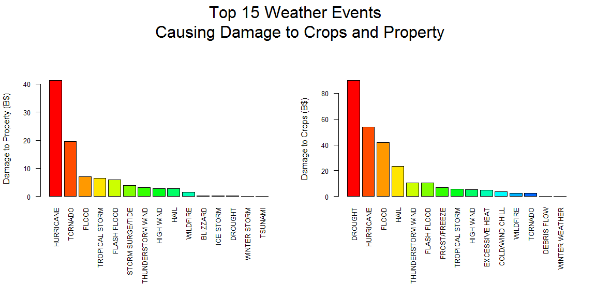

#### My course project 2 in the [Reproducible Research]("https://www.coursera.org/course/repdata") course

### Course Description

This repository contains my course projects 2 submitted through GitHub for the course [Reproducible Research]("https://www.coursera.org/course/repdata") in Coursera. This is the fifth course in the Johns Hopkins Data Science Specialization. The objective of the course is to teach the learner the concepts and tools behind reporting modern data analyses in a reproducible manner.

### Course project 2 requirement

The basic goal of the second assignment is to explore the NOAA Storm Database and answer some basic questions about severe weather events. The analysis can consist of tables, figures, or other summaries written in a Rmarkdown document and processed as an html document. The final report will then be published in RPubs.

### Sample plot

### Content 

This Repo contains the following:

- A ReadME markdown document
- A PARR2.Rmd
- A PARR2.md
- A PARR2_files
- A PARR2_cache
- A plot1.png file

The README markdown document is displayed by default by GitHub whenever you visit a GitHub repository. The document you are reading now is the README.md file. This README markdown document contains information about the content of this repo and instructions on how to use the content of this repo

The PARR2.Rmd file contains my second project for this course in R Markdown format.

The PARR2.md file contains my second project for this course in markdown format.

The PARR2.html file contains my second project for this course in html format.

The PARR2_files folder contains images displayed in the report.

The PARR2_cache folder contains codes in the report that were cached to save on time.

The plot1.png is an image file in .png format dispalyed in the README.md document.

