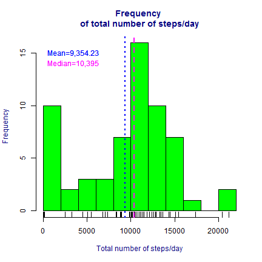
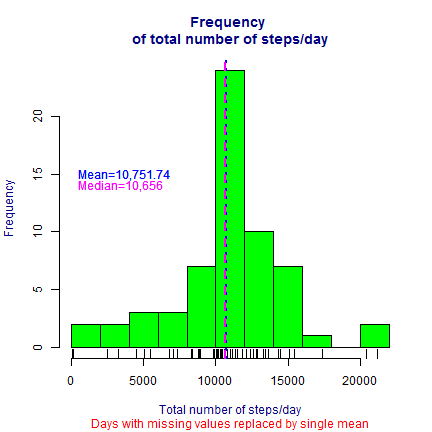
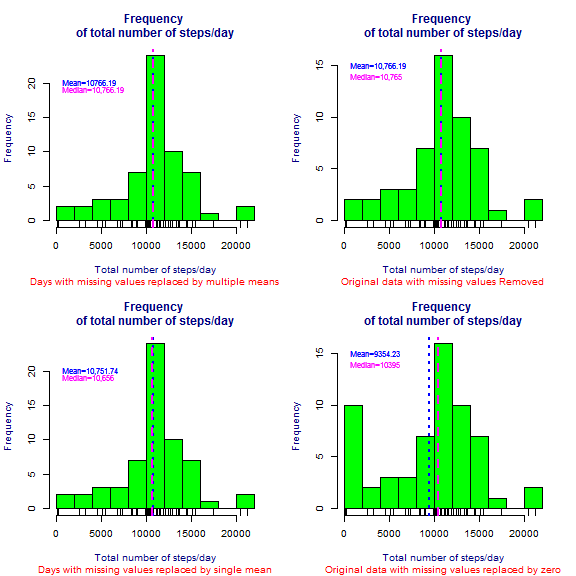
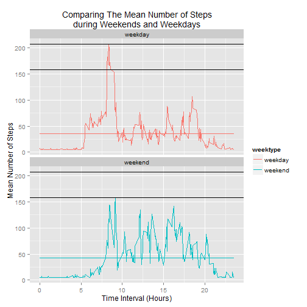

## Introduction
This course focuses on the concepts and tools behind reporting modern data analyses in a reproducible manner. Reproducible research is the idea that data analyses, and more generally, scientific claims, are published with their data and software code so that others may verify the findings and build upon them. The need for reproducibility is increasing dramatically as data analyses become more complex, involving larger datasets and more sophisticated computations. Reproducibility allows for people to focus on the actual content of a data analysis, rather than on superficial details reported in a written summary Taken from the website of [Reproducible Research](https://www.coursera.org/course/repdata).

This particular assignment, the first in this course, familiarizes the student with the use of R Markdown and the package Knitr for reporting data analysis.  It introduces the concept of imputation and how analysis is largely affected by presence and management of NAs or missing data.  It also hones the students skill in subsetting, working with dates, creating graphs and aggregating data using R programming.

This assignment is submitted for the fulfillment of the requirements in Coursera's Reproducibe Research Peer Assessment 1. 


```r
setwd("C:/Users/Ed/datasciencecoursera/RepData_PeerAssessment1")
```

## Loading the data

The data for this assignment can be downloaded from the course web site:
    Dataset: [Activity monitoring data](https://d396qusza40orc.cloudfront.net/repdata%2Fdata%2Factivity.zip) [52K]

The variables included in this dataset are:

    steps: Number of steps taking in a 5-minute interval (missing values are coded as NA)

    date: The date on which the measurement was taken in YYYY-MM-DD format

    interval: Identifier for the 5-minute interval in which measurement was taken

The dataset is stored in a comma-separated-value (CSV) file and there are a total of 17,568 observations in this dataset.

```r
fileurl <- "http://d396qusza40orc.cloudfront.net/repdata%2Fdata%2Factivity.zip"
download.file(fileurl, destfile = "./activity.zip")
dateDownloaded <- date()
print(dateDownloaded)
```

```
## [1] "Wed Nov 04 20:05:53 2015"
```

```r
unzip('activity.zip')
act <- read.csv("activity.csv", header = TRUE, stringsAsFactors = FALSE)
str(act)
```

```
## 'data.frame':	17568 obs. of  3 variables:
##  $ steps   : int  NA NA NA NA NA NA NA NA NA NA ...
##  $ date    : chr  "2012-10-01" "2012-10-01" "2012-10-01" "2012-10-01" ...
##  $ interval: int  0 5 10 15 20 25 30 35 40 45 ...
```

```r
summary(act)
```

```
##      steps            date              interval     
##  Min.   :  0.00   Length:17568       Min.   :   0.0  
##  1st Qu.:  0.00   Class :character   1st Qu.: 588.8  
##  Median :  0.00   Mode  :character   Median :1177.5  
##  Mean   : 37.38                      Mean   :1177.5  
##  3rd Qu.: 12.00                      3rd Qu.:1766.2  
##  Max.   :806.00                      Max.   :2355.0  
##  NA's   :2304
```

```r
head(act) 
```

```
##   steps       date interval
## 1    NA 2012-10-01        0
## 2    NA 2012-10-01        5
## 3    NA 2012-10-01       10
## 4    NA 2012-10-01       15
## 5    NA 2012-10-01       20
## 6    NA 2012-10-01       25
```

Examination of the summary of the data showed that observations were recorded on a 24 hour period for 61 days with 5 minute intervals.

## Preprocessing the data

We transformed the data from the variable column date and added column variables to represent the months (months), days of the week, and days of the year (yday) when the data was recorded.  Observation were recorded from the 274^th^ to the 334^th^ day of the year 2012 or from October 1, 2012 to November 30, 2012.  


```r
act$date <- as.Date(act$date)
act$months <- month.name[as.POSIXlt(act$date)$mon + 1]
act$weekday <- as.POSIXlt(act$date)$wday + 1
act$weekday <- factor(act$weekday, labels = c("Sunday", "Monday", "Tuesday", "Wednesday", "Thursday", "Friday", "Saturday"))
act$yday <- as.POSIXlt(act$date)$yday
head(act)
```

```
##   steps       date interval  months weekday yday
## 1    NA 2012-10-01        0 October  Monday  274
## 2    NA 2012-10-01        5 October  Monday  274
## 3    NA 2012-10-01       10 October  Monday  274
## 4    NA 2012-10-01       15 October  Monday  274
## 5    NA 2012-10-01       20 October  Monday  274
## 6    NA 2012-10-01       25 October  Monday  274
```

## What is the mean total number of steps taken per day?

To answer the question, we first took the sum of the number of steps taken each day for the 61 days of the observation period.  


```r
library(dplyr)
by_yday <-group_by(act, yday)
sum_byyday <- summarise(by_yday, sum(steps, na.rm = TRUE))
colnames(sum_byyday) <- c("nth_day", "sum_steps")
head(sum_byyday)
```

```
## Source: local data frame [6 x 2]
## 
##   nth_day sum_steps
## 1     274         0
## 2     275       126
## 3     276     11352
## 4     277     12116
## 5     278     13294
## 6     279     15420
```

To obtain the mean, we summed the total number of steps taken each day for each of the days of the observation period (570608) and divided it by the total number of days of the the observation period (61).
**NOTE** The days with 0 values in the sum_byyday data frame do not indicate 0 steps taken during these days but rather there was no observation recorded for these days or data was missing. We shall see later that several days in our data contain missing values or observations for the whole day and we shall also see how the value of 0 was assigned to these days.  We include these days in the analysis for now.


```r
mean_steps_per_day <- mean(sum_byyday$sum_steps, na.rm = TRUE)
print(mean_steps_per_day)
```

```
## [1] 9354.23
```

We obtained the median using the equation $Median = (n +1/2)^{th} term$


```r
median_steps_per_day <- median(sum_byyday$sum_steps, na.rm = TRUE)
print(median_steps_per_day)
```

```
## [1] 10395
```

We present the results by creating a histogram to show the frequency distribution of the total number of steps per day. We added two vertical lines to show the median and the mean.


```r
hist(sum_byyday$sum_steps, col = "green", breaks = 8, xlab = "Total number of steps/day", main = "Frequency \nof total number of steps/day", col.main = "navy", col.lab = "navy", cex = 1.5)
rug(sum_byyday$sum_steps)
abline(v = mean(sum_byyday$sum_steps, na.rm = TRUE), col = "blue", lwd = 2, lty = 3)
abline(v = median(sum_byyday$sum_steps, na.rm = TRUE), col = "magenta", lwd = 2, lty = 2)
text(c(15,15), pos = 4, "Mean=9,354.23", cex = 1, col = "blue")
text(c(14,14), pos = 4, "Median=10,395", cex = 1, col = "magenta")
```

 

## What is the average daily activity pattern?

To answer the question, we first grouped the number of steps taken, according to the five minute intervals of observation each day. We then made a time series plot (i.e. type = "l") of the 5-minute interval (x-axis) and the average number of steps taken, averaged across all days (y-axis).  To improve readability, we changed the column variable names to be more descriptive.


```r
by_interval <-group_by(act, interval)
meanstep_byinterval <- summarise(by_interval, mean(steps, na.rm = TRUE))
colnames(meanstep_byinterval) <- c("interval", "mean_steps")
print(meanstep_byinterval)
```

```
## Source: local data frame [288 x 2]
## 
##    interval mean_steps
## 1         0  1.7169811
## 2         5  0.3396226
## 3        10  0.1320755
## 4        15  0.1509434
## 5        20  0.0754717
## 6        25  2.0943396
## 7        30  0.5283019
## 8        35  0.8679245
## 9        40  0.0000000
## 10       45  1.4716981
## ..      ...        ...
```

Taking the mean of the total number of steps taken for each 5-minute interval throughout the day, we then determined what was the highest mean number of steps taken throughout the day. 


```r
maxsteps_byinterval <- max(meanstep_byinterval$mean_steps, na.rm = TRUE)
print(maxsteps_byinterval)
```

```
## [1] 206.1698
```
We then determined at which time interval did the highest mean number of steps occurred.


```r
interval_with_moststeps <- meanstep_byinterval[meanstep_byinterval$mean_steps == maxsteps_byinterval, ]
print(interval_with_moststeps)                                
```

```
## Source: local data frame [1 x 2]
## 
##   interval mean_steps
## 1      835   206.1698
```
 
The highest mean number of steps occurred occurred at 8:35 am.
 

```r
plot(meanstep_byinterval$interval/100, meanstep_byinterval$mean_steps, type = "l", xlab = "Time Interval (Hours)", ylab = "Mean number of steps") 
abline(h = max(meanstep_byinterval$mean_steps, na.rm = TRUE), col = "magenta", lwd = 2, lty = 2)
title(main = "Mean number of steps\nfor each Time Interval", col.main = "navy")
text(c(180), pos = 4, offset = 11.1, "Max Steps=206.1698", cex = 1, col = "magenta")
text(c(150), pos = 4, offset = 11.1, "Time Interval=8:35 am", cex = 1, col = "blue") 
```

 

## Imputing missing values

To Calculate and report the total number and percent of missing values in the dataset (i.e. the total number of rows with NAs), we use the following commands in R.

### Proportion of missing values in the data


```r
sum(is.na(act))
```

```
## [1] 2304
```

```r
mean(is.na(act))
```

```
## [1] 0.02185792
```

```r
sum(is.na(act$date))
```

```
## [1] 0
```

```r
sum(is.na(act$interval))
```

```
## [1] 0
```

```r
sum(is.na(act$steps))
```

```
## [1] 2304
```

```r
mean(is.na(act$steps))
```

```
## [1] 0.1311475
```

```r
mean(!is.na(act$steps))
```

```
## [1] 0.8688525
```

We can see that the number of missing values or NAs  compared to the total number of values in the the whole data (2.19%) is few.  However, if we look at the percentage of NAs in the steps variable column, we find that the number of NAs compared to the total number of observations in this column is high (13.11%). The high percentage of missing data in this variable column (In fact all missing values are located in this Varible column) can significantly affect the analysis of the data involving this variable.  We can further investigate the distribution of these missing values.


```r
missing_values <- is.na(act$steps)
NA_days <- act[missing_values, ]
NA_dates <- unique(NA_days$date)
days_withNAs <- format(as.POSIXct(NA_dates), "%+")
print(days_withNAs)
```

```
## [1] "Mon Oct  1 08:00:00 MYT 2012" "Mon Oct  8 08:00:00 MYT 2012"
## [3] "Thu Nov  1 08:00:00 MYT 2012" "Sun Nov  4 08:00:00 MYT 2012"
## [5] "Fri Nov  9 08:00:00 MYT 2012" "Sat Nov 10 08:00:00 MYT 2012"
## [7] "Wed Nov 14 08:00:00 MYT 2012" "Fri Nov 30 08:00:00 MYT 2012"
```

We can see that the missing values are isolated in certain dates.  In the following, we shall see that the NAs are not only located in certain days, but rather all throughout those particular days. 


```r
wholeday_NAs <- with(act, tapply(steps, date, summary)) 
print(wholeday_NAs[c(1, 8, 32, 35, 40, 41, 45, 61)])
```

```
## $`2012-10-01`
##    Min. 1st Qu.  Median    Mean 3rd Qu.    Max.    NA's 
##      NA      NA      NA     NaN      NA      NA     288 
## 
## $`2012-10-08`
##    Min. 1st Qu.  Median    Mean 3rd Qu.    Max.    NA's 
##      NA      NA      NA     NaN      NA      NA     288 
## 
## $`2012-11-01`
##    Min. 1st Qu.  Median    Mean 3rd Qu.    Max.    NA's 
##      NA      NA      NA     NaN      NA      NA     288 
## 
## $`2012-11-04`
##    Min. 1st Qu.  Median    Mean 3rd Qu.    Max.    NA's 
##      NA      NA      NA     NaN      NA      NA     288 
## 
## $`2012-11-09`
##    Min. 1st Qu.  Median    Mean 3rd Qu.    Max.    NA's 
##      NA      NA      NA     NaN      NA      NA     288 
## 
## $`2012-11-10`
##    Min. 1st Qu.  Median    Mean 3rd Qu.    Max.    NA's 
##      NA      NA      NA     NaN      NA      NA     288 
## 
## $`2012-11-14`
##    Min. 1st Qu.  Median    Mean 3rd Qu.    Max.    NA's 
##      NA      NA      NA     NaN      NA      NA     288 
## 
## $`2012-11-30`
##    Min. 1st Qu.  Median    Mean 3rd Qu.    Max.    NA's 
##      NA      NA      NA     NaN      NA      NA     288
```

### Distribution of missing values in the data

In the following we can see that there are more missing values in November than in October.  More Missing values are found in Mondays and Fridays (represented by 2 and 6) compared to the rest of the week and there are no missing values on Tuesdays. The NAs are uniformly distributed in the observation intervals throughout the day.


```r
NAdf <- act[is.na(act$steps), ]
table(NAdf$months)
```

```
## 
## November  October 
##     1728      576
```

```r
table(NAdf$weekday)
```

```
## 
##    Sunday    Monday   Tuesday Wednesday  Thursday    Friday  Saturday 
##       288       576         0       288       288       576       288
```

```r
table(NAdf$interval)
```

```
## 
##    0    5   10   15   20   25   30   35   40   45   50   55  100  105  110 
##    8    8    8    8    8    8    8    8    8    8    8    8    8    8    8 
##  115  120  125  130  135  140  145  150  155  200  205  210  215  220  225 
##    8    8    8    8    8    8    8    8    8    8    8    8    8    8    8 
##  230  235  240  245  250  255  300  305  310  315  320  325  330  335  340 
##    8    8    8    8    8    8    8    8    8    8    8    8    8    8    8 
##  345  350  355  400  405  410  415  420  425  430  435  440  445  450  455 
##    8    8    8    8    8    8    8    8    8    8    8    8    8    8    8 
##  500  505  510  515  520  525  530  535  540  545  550  555  600  605  610 
##    8    8    8    8    8    8    8    8    8    8    8    8    8    8    8 
##  615  620  625  630  635  640  645  650  655  700  705  710  715  720  725 
##    8    8    8    8    8    8    8    8    8    8    8    8    8    8    8 
##  730  735  740  745  750  755  800  805  810  815  820  825  830  835  840 
##    8    8    8    8    8    8    8    8    8    8    8    8    8    8    8 
##  845  850  855  900  905  910  915  920  925  930  935  940  945  950  955 
##    8    8    8    8    8    8    8    8    8    8    8    8    8    8    8 
## 1000 1005 1010 1015 1020 1025 1030 1035 1040 1045 1050 1055 1100 1105 1110 
##    8    8    8    8    8    8    8    8    8    8    8    8    8    8    8 
## 1115 1120 1125 1130 1135 1140 1145 1150 1155 1200 1205 1210 1215 1220 1225 
##    8    8    8    8    8    8    8    8    8    8    8    8    8    8    8 
## 1230 1235 1240 1245 1250 1255 1300 1305 1310 1315 1320 1325 1330 1335 1340 
##    8    8    8    8    8    8    8    8    8    8    8    8    8    8    8 
## 1345 1350 1355 1400 1405 1410 1415 1420 1425 1430 1435 1440 1445 1450 1455 
##    8    8    8    8    8    8    8    8    8    8    8    8    8    8    8 
## 1500 1505 1510 1515 1520 1525 1530 1535 1540 1545 1550 1555 1600 1605 1610 
##    8    8    8    8    8    8    8    8    8    8    8    8    8    8    8 
## 1615 1620 1625 1630 1635 1640 1645 1650 1655 1700 1705 1710 1715 1720 1725 
##    8    8    8    8    8    8    8    8    8    8    8    8    8    8    8 
## 1730 1735 1740 1745 1750 1755 1800 1805 1810 1815 1820 1825 1830 1835 1840 
##    8    8    8    8    8    8    8    8    8    8    8    8    8    8    8 
## 1845 1850 1855 1900 1905 1910 1915 1920 1925 1930 1935 1940 1945 1950 1955 
##    8    8    8    8    8    8    8    8    8    8    8    8    8    8    8 
## 2000 2005 2010 2015 2020 2025 2030 2035 2040 2045 2050 2055 2100 2105 2110 
##    8    8    8    8    8    8    8    8    8    8    8    8    8    8    8 
## 2115 2120 2125 2130 2135 2140 2145 2150 2155 2200 2205 2210 2215 2220 2225 
##    8    8    8    8    8    8    8    8    8    8    8    8    8    8    8 
## 2230 2235 2240 2245 2250 2255 2300 2305 2310 2315 2320 2325 2330 2335 2340 
##    8    8    8    8    8    8    8    8    8    8    8    8    8    8    8 
## 2345 2350 2355 
##    8    8    8
```

The next part of the assignment directs us to create a systematic strategy to replace the missing values, a process called imputation. There are several ways to implement imputation.

First, we make a copy of our original data frame to protect the data from being changed


```r
imp_act <- act
head(imp_act)
```

```
##   steps       date interval  months weekday yday
## 1    NA 2012-10-01        0 October  Monday  274
## 2    NA 2012-10-01        5 October  Monday  274
## 3    NA 2012-10-01       10 October  Monday  274
## 4    NA 2012-10-01       15 October  Monday  274
## 5    NA 2012-10-01       20 October  Monday  274
## 6    NA 2012-10-01       25 October  Monday  274
```

There are several strategies to replace missing values using single or multiple mean values.  The simplest solution to  replace the missing values is to use the impute function from the package Hmisc.  The impute function replaces all the missing values or NAs with a single value, the mean of all the values found in the variable column steps (37). 


```r
library(Hmisc)
imp_act$steps <- round(impute(imp_act$steps, mean))
sumNAS_imp_act <- sum(is.na(imp_act))
head(imp_act)
```

```
##   steps       date interval  months weekday yday
## 1    37 2012-10-01        0 October  Monday  274
## 2    37 2012-10-01        5 October  Monday  274
## 3    37 2012-10-01       10 October  Monday  274
## 4    37 2012-10-01       15 October  Monday  274
## 5    37 2012-10-01       20 October  Monday  274
## 6    37 2012-10-01       25 October  Monday  274
```

```r
print(sumNAS_imp_act)
```

```
## [1] 0
```

After imputation, we can see now that there are 0 missing values in our new data frame with imputed values.


```r
impactby_yday <-group_by(imp_act, yday)
impactsum_byyday <- summarise(impactby_yday, sum(steps, na.rm = TRUE))
colnames(impactsum_byyday) <- c("nth_day", "sum_steps")
head(impactsum_byyday)
```

```
## Source: local data frame [6 x 2]
## 
##   nth_day sum_steps
## 1     274     10656
## 2     275       126
## 3     276     11352
## 4     277     12116
## 5     278     13294
## 6     279     15420
```

We now make a histogram to show the the frequency distribution of the number of steps taken in the new data set with imputed values. But first, we will compute the mean and median for comparison with the previous data frame without imputed values. 


```r
mean_imp_stepsbyday <- mean(impactsum_byyday$sum_steps, na.rm = TRUE)
print(mean_imp_stepsbyday)
```

```
## [1] 10751.74
```

```r
median_imp_stepsbyday <- median(impactsum_byyday$sum_steps, na.rm = TRUE)
print(median_imp_stepsbyday)
```

```
## [1] 10656
```

We now make the histogram


```r
hist(impactsum_byyday$sum_steps, col = "green", breaks = 8, xlab = "Total number of steps/day", main = "Frequency \nof total number of steps/day", sub = "Days with missing values replaced by single mean", col.main = "navy", col.lab = "navy", col.sub = "red", cex = 1,5)
rug(impactsum_byyday$sum_steps)
abline(v = mean(impactsum_byyday$sum_steps, na.rm = TRUE), col = "blue", lwd = 2, lty = 3)
abline(v = median(impactsum_byyday$sum_steps, na.rm = TRUE), col = "magenta", lwd = 2, lty = 2)
text(c(15,15), pos = 4, "Mean=10,751.74", cex = 1, col = "blue")
text(c(14,14), pos = 4, "Median=10,656", cex = 1, col = "magenta")
```

 

Do these values differ from the estimates from the first part of the assignment? What is the impact of imputing missing data on the estimates of the total daily number of steps? Let's compare it with the original data.

Comparing the histograms of the data with NAs and the one with imputed values we can see that the mean and median of the data set with imputed values are closer together, indicating that the distribution of values in the steps variable have narrowed or grown closer together.  Results appear to have homogenized. Although, range, the maximum and the minimum value, are not affected. Values approximating the mean increased in frequency as expected.

A study  entitled ["Impact of missing data imputation methods on gene expression clustering and classification"](http://www.biomedcentral.com/1471-2105/16/64) performed a broad analysis of the impact of five well-known missing value imputation methods on three clustering and four classification methods in the context of 12 cancer gene expression datasets. 

Their results suggest that the imputation methods evaluated have a minor impact on the classification and downstream clustering analyses and concluded that simple methods such as replacing the missing values by mean or the median values performed as well as more complex strategies.

However, our esteemed professor, Dr. Roger D Peng in his lecture video [Evidence-based Data Analysis Part 3](https://class.coursera.org/repdata-033/lecture/45) explicitly stated that replacing missing values should not be performed.  In the particular scenario of a pollution study, data is hard to collect.  Data is collected once every six days and values are systematically missing for five days. "Imputing values for the days where there are no observation simply add more noise to the data".

### An alternative way to impute using multiple mean values.

Taking into account the distribution of NAS. From the above, we know that the NAs are equally distributed over the different time intervals.

Since the missing values are equally distributed in the time intervals, taking the mean number of steps grouped by intervals will provide a closer approximation of the value instead of using a single value to replace all missing values.


```r
by_interval <-group_by(act, interval)
meanstep_byinterval <- summarise(by_interval, mean(steps, na.rm = TRUE))
colnames(meanstep_byinterval) <- c("interval", "mean_steps")
mean_act <- merge(act,meanstep_byinterval)
```

Let's take a look at a few rows of the new column variable mean_steps that contain the values that will replace the NAs in the steps column variable.


```r
mean_act <- arrange(mean_act, date)
head(mean_act, 6)
```

```
##   interval steps       date  months weekday yday mean_steps
## 1        0    NA 2012-10-01 October  Monday  274  1.7169811
## 2        5    NA 2012-10-01 October  Monday  274  0.3396226
## 3       10    NA 2012-10-01 October  Monday  274  0.1320755
## 4       15    NA 2012-10-01 October  Monday  274  0.1509434
## 5       20    NA 2012-10-01 October  Monday  274  0.0754717
## 6       25    NA 2012-10-01 October  Monday  274  2.0943396
```

Let's replace the NAs in the steps column variable


```r
mean_act$steps[is.na(mean_act$steps)] <- mean_act$mean_steps[is.na(mean_act$steps)]
sum(is.na(mean_act))
```

```
## [1] 0
```

```r
head(mean_act, 10)
```

```
##    interval     steps       date  months weekday yday mean_steps
## 1         0 1.7169811 2012-10-01 October  Monday  274  1.7169811
## 2         5 0.3396226 2012-10-01 October  Monday  274  0.3396226
## 3        10 0.1320755 2012-10-01 October  Monday  274  0.1320755
## 4        15 0.1509434 2012-10-01 October  Monday  274  0.1509434
## 5        20 0.0754717 2012-10-01 October  Monday  274  0.0754717
## 6        25 2.0943396 2012-10-01 October  Monday  274  2.0943396
## 7        30 0.5283019 2012-10-01 October  Monday  274  0.5283019
## 8        35 0.8679245 2012-10-01 October  Monday  274  0.8679245
## 9        40 0.0000000 2012-10-01 October  Monday  274  0.0000000
## 10       45 1.4716981 2012-10-01 October  Monday  274  1.4716981
```

```r
tail(mean_act, 10)
```

```
##       interval     steps       date   months weekday yday mean_steps
## 17559     2310 0.0000000 2012-11-30 November  Friday  334  0.0000000
## 17560     2315 0.8301887 2012-11-30 November  Friday  334  0.8301887
## 17561     2320 0.9622642 2012-11-30 November  Friday  334  0.9622642
## 17562     2325 1.5849057 2012-11-30 November  Friday  334  1.5849057
## 17563     2330 2.6037736 2012-11-30 November  Friday  334  2.6037736
## 17564     2335 4.6981132 2012-11-30 November  Friday  334  4.6981132
## 17565     2340 3.3018868 2012-11-30 November  Friday  334  3.3018868
## 17566     2345 0.6415094 2012-11-30 November  Friday  334  0.6415094
## 17567     2350 0.2264151 2012-11-30 November  Friday  334  0.2264151
## 17568     2355 1.0754717 2012-11-30 November  Friday  334  1.0754717
```

We now take the total number of steps each day, 


```r
multiimpactby_yday <-group_by(mean_act, yday)
multiimpactsum_byyday <- summarise(multiimpactby_yday, sum(steps, na.rm = TRUE))
colnames(multiimpactsum_byyday) <- c("nth_day", "sum_steps")
head(multiimpactsum_byyday)
```

```
## Source: local data frame [6 x 2]
## 
##   nth_day sum_steps
## 1     274  10766.19
## 2     275    126.00
## 3     276  11352.00
## 4     277  12116.00
## 5     278  13294.00
## 6     279  15420.00
```
We can now see the result of our imputation with multiple mean values.  Let's make a histogram for comparison with our original data and the one with missing values replaced by a single mean value. We added two vertical lines to show the median and the mean.


```r
par(mfrow=c(1,3))
hist(multiimpactsum_byyday$sum_steps, col = "green", breaks = 8, xlab = "Total number of steps/day", main = "Frequency \nof total number of steps/day", sub = "Days with missing values replaced with multiple means", col.main = "navy", col.lab = "navy", col.sub = "red", cex = 1.5)
rug(multiimpactsum_byyday$sum_steps)
abline(v = mean(multiimpactsum_byyday$sum_steps, na.rm = TRUE), col = "blue", lwd = 2, lty = 3)
abline(v = median(multiimpactsum_byyday$sum_steps, na.rm = TRUE), col = "magenta", lwd = 2, lty = 2)
text(c(15,15), pos = 4, "Mean=10766.19", cex = 1, col = "blue")
text(c(14,14), pos = 4, "Median=10,766.19", cex = 1, col = "magenta")

hist(sum_byyday$sum_steps, col = "green", breaks = 8, xlab = "Total number of steps/day", main = "Frequency \nof total number of steps/day", sub = "Original data with missing values replaced by zero", col.main = "navy", col.lab = "navy", col.sub = "red", cex = 1.5)
rug(sum_byyday$sum_steps)
abline(v = mean(sum_byyday$sum_steps, na.rm = TRUE), col = "blue", lwd = 2, lty = 3)
abline(v = median(sum_byyday$sum_steps, na.rm = TRUE), col = "magenta", lwd = 2, lty = 2) 
text(c(15,15), pos = 4, "Mean=9354.23", cex = 1, col = "blue")
text(c(14,14), pos = 4, "Median=10395", cex = 1, col = "magenta")

hist(impactsum_byyday$sum_steps, col = "green", breaks = 8, xlab = "Total number of steps/day", main = "Frequency \nof total number of steps/day", sub = "Days with missing values replaced by single mean", col.main = "navy", col.lab = "navy", col.sub = "red", cex = 1.5)
rug(impactsum_byyday$sum_steps)
abline(v = mean(impactsum_byyday$sum_steps, na.rm = TRUE), col = "blue", lwd = 2, lty = 3)
abline(v = median(impactsum_byyday$sum_steps, na.rm = TRUE), col = "magenta", lwd = 2, lty = 2)
text(c(15,15), pos = 4, "Mean=10751.74", cex = 1, col = "blue")
text(c(14,14), pos = 4, "Median=10,656", cex = 1, col = "magenta")
```

 

Imputation by a single mean value (plot on the right) or multiple mean values (plot on the left) resulted in the median approximating the mean, since the values we imputed were based on mean values. It might not be very obvious, but all three plota underwent the process of imputation.  The middle plot had its NAs replaced as a by-product of using the function summarise (dplyr package) in conjunction with the function sum and its argument na.rm = TRUE, to obtain the total number of steps per day. The missing values were assigned the value of *zero* on days where all observations were missing. 

### Comparing  histograms of the same data that underwent different strategies of imputation and the same data where missing values were removed.

There are 8 days where the total number of steps is 0.  The number of steps is not actually zero, but rather, data during these days are missing.  During the computation for the total number of steps, the missing values were conveniently represented by 0


```r
sum_byydayNA <- sum_byyday[sum_byyday$sum_steps == 0, ]
print(sum_byydayNA)
```

```
## Source: local data frame [8 x 2]
## 
##   nth_day sum_steps
## 1     274         0
## 2     281         0
## 3     305         0
## 4     308         0
## 5     313         0
## 6     314         0
## 7     318         0
## 8     334         0
```

```r
sum_byydaynoNA <- sum_byyday[sum_byyday$sum_steps != 0, ]
head(sum_byydaynoNA)
```

```
## Source: local data frame [6 x 2]
## 
##   nth_day sum_steps
## 1     275       126
## 2     276     11352
## 3     277     12116
## 4     278     13294
## 5     279     15420
## 6     280     11015
```

Removing these days in the computation of the mean and median yields a similar mean and median where the missing values are replaced by single or multiple mean values.


```r
par(mfrow=c(2,2))
hist(multiimpactsum_byyday$sum_steps, col = "green", breaks = 8, xlab = "Total number of steps/day", main = "Frequency \nof total number of steps/day", sub = "Days with missing values replaced by multiple means", col.main = "navy", col.lab = "navy", col.sub = "red", cex = 2.5)
rug(multiimpactsum_byyday$sum_steps)
abline(v = mean(multiimpactsum_byyday$sum_steps, na.rm = TRUE), col = "blue", lwd = 2, lty = 3)
abline(v = median(multiimpactsum_byyday$sum_steps, na.rm = TRUE), col = "magenta", lwd = 2, lty = 2)
text(c(20,20), pos = 4, "Mean=10766.19", cex = 0.8, col = "blue")
text(c(19,19), pos = 4, "Median=10,766.19", cex = 0.8, col = "magenta")

hist(sum_byydaynoNA$sum_steps, col = "green", breaks = 8, xlab = "Total number of steps/day", main = "Frequency \nof total number of steps/day", sub = "Original data with missing values Removed", col.main = "navy", col.lab = "navy", col.sub = "red", cex = 2.5)
rug(sum_byydaynoNA$sum_steps)
abline(v = mean(sum_byydaynoNA$sum_steps, na.rm = TRUE), col = "blue", lwd = 2, lty = 3)
abline(v = median(sum_byydaynoNA$sum_steps, na.rm = TRUE), col = "magenta", lwd = 2, lty = 2) 
text(c(15,15), pos = 4, "Mean=10,766.19", cex = 0.8, col = "blue")
text(c(14,14), pos = 4, "Median=10,765", cex = 0.8, col = "magenta")

hist(impactsum_byyday$sum_steps, col = "green", breaks = 8, xlab = "Total number of steps/day", main = "Frequency \nof total number of steps/day", sub = "Days with missing values replaced by single mean", col.main = "navy", col.lab = "navy", col.sub = "red", cex = 2.5)
rug(impactsum_byyday$sum_steps)
abline(v = mean(impactsum_byyday$sum_steps, na.rm = TRUE), col = "blue", lwd = 2, lty = 3)
abline(v = median(impactsum_byyday$sum_steps, na.rm = TRUE), col = "magenta", lwd = 2, lty = 2)
text(c(20,20), pos = 4, "Mean=10,751.74", cex = 0.8, col = "blue")
text(c(19,19), pos = 4, "Median=10,656", cex = 0.8, col = "magenta")

hist(sum_byyday$sum_steps, col = "green", breaks = 8, xlab = "Total number of steps/day", main = "Frequency \nof total number of steps/day", sub = "Original data with missing values replaced by zero", col.main = "navy", col.lab = "navy", col.sub = "red", cex = 1.5)
rug(sum_byyday$sum_steps)
abline(v = mean(sum_byyday$sum_steps, na.rm = TRUE), col = "blue", lwd = 2, lty = 3)
abline(v = median(sum_byyday$sum_steps, na.rm = TRUE), col = "magenta", lwd = 2, lty = 2) 
text(c(15,15), pos = 4, "Mean=9354.23", cex = 0.8, col = "blue")
text(c(14,14), pos = 4, "Median=10395", cex = 0.8, col = "magenta")
```

 

Based on our results, the median and mean yielded similar results when missing values were replaced through imputation with multiple or single mean values and when the missing values were removed. Unknowingly substituting missing values with zero leads to an error in extracting mean and median values.


## Are there differences in activity patterns between weekdays and weekends?

To answer the question, we make a new factor variable in the dataset with two levels - "weekday" and "weekend" indicating whether a given date is a weekday or weekend day. We then extract the mean of the variable steps grouped according to interval and weektype.  We will be using our data with the missing values replaced by a single mean value.


```r
imp_act <- mutate(imp_act, weektype = ifelse(imp_act$weekday == "Sunday" | imp_act$weekday == "Saturday", "weekend", "weekday"))
imp_byintwkt <-group_by(imp_act, interval, weektype)
sumimp_byintwkt <-summarise(imp_byintwkt, mean(steps))
colnames(sumimp_byintwkt)[3] <-c("mean_steps")
head(sumimp_byintwkt)
```

```
## Source: local data frame [6 x 3]
## Groups: interval
## 
##   interval weektype mean_steps
## 1        0  weekday   6.955556
## 2        0  weekend   4.625000
## 3        5  weekday   5.333333
## 4        5  weekend   4.625000
## 5       10  weekday   5.088889
## 6       10  weekend   4.625000
```

To visually compare the activity level during weekdays (Monday-Friday) and weekends (Saturday and Sunday), we make a panel plot containing a time series plot (i.e. type = "l") of the 5-minute interval (x-axis) and the average number of steps taken, averaged across all weekday days or weekend days (y-axis). 

```r
library(ggplot2)
g <- ggplot(sumimp_byintwkt, aes(x = interval/100, y = mean_steps, color = weektype)) + geom_line() + facet_wrap(~weektype, ncol = 1, nrow = 2) + ggtitle("Comparing The Mean Number of Steps\nduring Weekends and Weekdays") + xlab("Time Interval (Hours)") + ylab("Mean Number of Steps") + geom_hline(aes(yintercept= max(sumimp_byintwkt$mean_steps))) + geom_hline(aes(yintercept= max(subset(sumimp_byintwkt, sumimp_byintwkt$weektype == "weekend")$mean_steps))) + geom_line(stat="hline", yintercept="mean")
print(g)
```

 

1. The black horizontal lines represent the difference between the mean maximum number of steps during weekdays and weekends.  

2. The blue and pink horizontal lines represent the respective means of the mean number of steps during weekends and weekdays. It is surprising to know that the mean of the weekends (42.32) is greater than the mean during weekdays(35.56).

2. We can see from the above that activity or the number of steps  increases abruptly and earlier during weekdays, plateaus, and then abruptly increase again, reaching peak levels between 8 and 9 am. 

2. In comparison, activity or the number of steps during weekends begins gradually and have several small peaks throughout the day but never reaching the highest level seen during weekdays.  

2. Peak activity level in the afternoon are several during weekdays and weekends.  However, peak levels during weekdays are smaller compared to the peak activity levels in the afternoon on weekends.

2. Activity during weekdays tend to taper earlier (around 6 pm) during weekdays, compared to weekends, where activity levels begin to taper around 8 pm.

## Session Information


```r
sessionInfo()
```

```
## R version 3.2.1 (2015-06-18)
## Platform: i386-w64-mingw32/i386 (32-bit)
## Running under: Windows 8 (build 9200)
## 
## locale:
## [1] LC_COLLATE=English_United States.1252 
## [2] LC_CTYPE=English_United States.1252   
## [3] LC_MONETARY=English_United States.1252
## [4] LC_NUMERIC=C                          
## [5] LC_TIME=English_United States.1252    
## 
## attached base packages:
## [1] grid      stats     graphics  grDevices utils     datasets  methods  
## [8] base     
## 
## other attached packages:
## [1] Hmisc_3.16-0    ggplot2_1.0.1   Formula_1.2-1   survival_2.38-3
## [5] lattice_0.20-33 dplyr_0.4.2     knitr_1.11     
## 
## loaded via a namespace (and not attached):
##  [1] RColorBrewer_1.1-2  markdown_0.7.7      digest_0.6.8       
##  [4] htmltools_0.2.6     R6_2.1.0            splines_3.2.1      
##  [7] scales_0.2.5        assertthat_0.1      stringr_1.0.0      
## [10] munsell_0.4.2       proto_0.3-10        highr_0.5          
## [13] nnet_7.3-10         mime_0.3            acepack_1.3-3.3    
## [16] DBI_0.3.1           labeling_0.3        MASS_7.3-43        
## [19] rsconnect_0.3.79    plyr_1.8.3          stringi_0.5-5      
## [22] magrittr_1.5        reshape2_1.4.1      rmarkdown_0.7      
## [25] evaluate_0.7.2      gtable_0.1.2        colorspace_1.2-6   
## [28] foreign_0.8-65      yaml_2.1.13         tools_3.2.1        
## [31] parallel_3.2.1      cluster_2.0.3       gridExtra_2.0.0    
## [34] lazyeval_0.1.10     formatR_1.2         rpart_4.1-10       
## [37] Rcpp_0.12.0         latticeExtra_0.6-26
```
