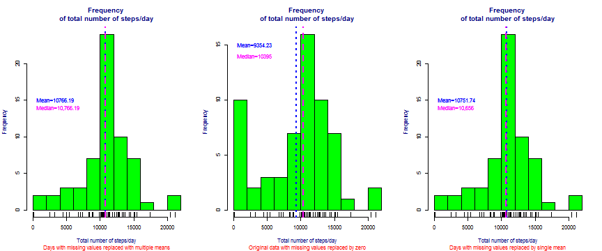
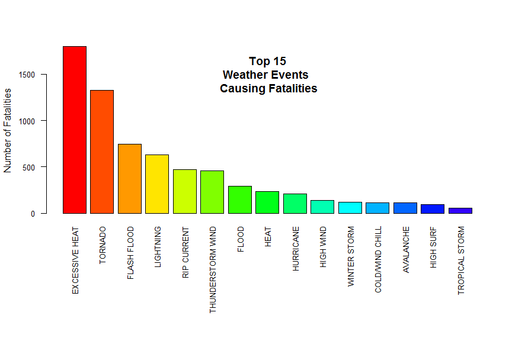

### My course project in the [Reproducible Research]("https://www.coursera.org/course/repdata")

### Course Description

This folder contains my course projects 1 and 2 submitted through GitHub for the course [Reproducible Research]("https://www.coursera.org/course/repdata") in Coursera. This is the fifth course in the Johns Hopkins Data Science Specialization. The objective of the course is to teach the learner the concepts and tools behind reporting modern data analyses in a reproducible manner.

### Course project 1 requirement

For the first project, the student will need to write a report that answers several questions about the data written in a single R markdown document that can be processed by knitr and be transformed into an HTML file.

### Sample plot

### Course project 2 requirement

The basic goal of the second assignment is to explore the NOAA Storm Database and answer some basic questions about severe weather events. The analysis can consist of tables, figures, or other summaries written in a Rmarkdown document and processed as an html document. The final report will then be published in RPubs.

### Sample plot

### Content 

This folder contains the following:

- A ReadME markdown document
- A CourseProject1 folder
- A CourseProject2 folder
- A plot1.png file
- A index2.png file

The README markdown document is displayed by default by GitHub whenever you visit a GitHub repository. The document you are reading now is the README.md file. This README markdown document contains information about the content of this repo and instructions on how to use the content of this repo

The CourseProject1 folder contains my first project for this course.

The CourseProject2 folder contains my second project for this course.

The plot1.png is an image file in .png format dispalyed in the README.md document.

The index2.png is an image file in .png format dispalyed in the README.md document.

To download the content of this repository as a .zip file, click on the Download ZIP button. If you have a GitHub account, you can fork the content so you'll have a copy on your GitHub account.  
