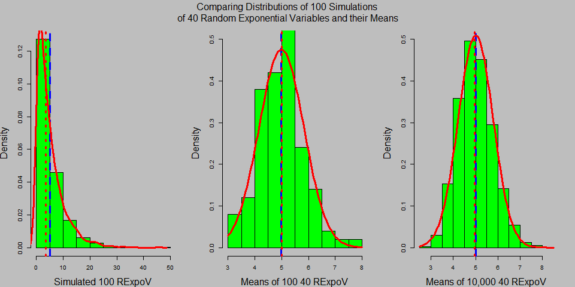
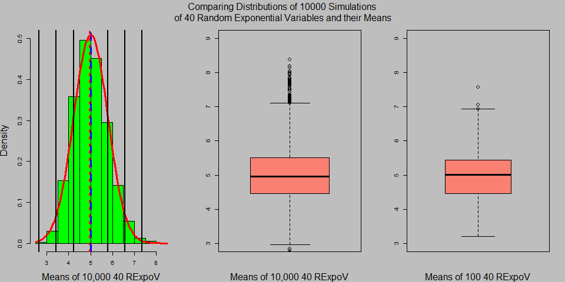
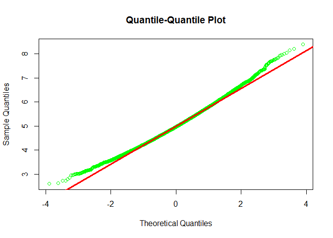

#### My course project in the [Statistical Inference]("https://www.coursera.org/course/statinference")

### Course Description

This markdown document contains my first course project submitted through GitHub for the course [Statistical Inference]("https://www.coursera.org/course/statinference") in Coursera. This is the sixth course in the Johns Hopkins Data Science Specialization. The objective of the course is to teach the learner how to gather, clean, and manage data from a variety of sources using R.

[](https://d3njjcbhbojbot.cloudfront.net/api/utilities/v1/imageproxy/)

### Synopsis
The Central Limit Theorem (CLT) states that the distribution of averages of iid variables becomes that of a standard normal as the sample size increases, regardless of the underlying distribution. We know from the Law of Large Numbers (LLN) that the sample mean/variance/standard deviation are all consistent estimators of their population counterparts. Using the Exponential Distribution in R we will show how the distribution of averages of iid variables approximates that of a standard normal distribution as the sample size increases.

### Simulations

We compare the distributions of 100 simulations of 40 random exponentials variables (RExpoV) and their means.  We simulated the data using rexp(n, lambda) where lambda is the rate parameter set at 0.2 and present its distribution in a histogram. The mean of the exponential distribution (theoretical mean) is 1/lambda and the standard deviation is also 1/lambda (theoretical standard deviation).



We can see that the distribution of the simulated data from an exponential distribution (figure on the left) is far from symmetrical, a far cry from the familiar shape of the bell curve of the normal distribution.  However, the means of these Exponential random variables (figure in the middle and on the right) approximate a normal distribution in accordance with the Central Limit Theorem.

Even with just a hundred simulations, the distribution of averages of 40 rexp variables slightly resemble the shape of a bell curve with the median (red line) approximating the mean (blue line).  Increasing the number of simulations to 10,000 further aproximated the normal distribution, becoming more compact in the middle, increasing in height, in agreement with the Central Limit Theorem. 

### Comparing the sample mean with the theoretical mean

The mean of our  100 simulations (**4.9926226**) and 10,000 simulations (**5.006966**) closely approximates the (theoretical) mean of the exponential distribution which is equal to 1/lambda = 1/.2 = 5.  We know that the sample mean is an unbiased and consistent estimator of the population mean, from the Law of Large Numbers. Even with just a 100 simulations the mean is closely approximated resulting in a more normal-like distribution near the peak. 

### Comparing the sample variance with the theoretical variance

From the standard deviation of RExpoV (1/lambda = 5), we can compute the (theoretical) variance ((1/lambda)^2/n = 25/40= 0.625). The variance of our sample of 100 means (**0.7043916**) and  10,000 (**0.6134287**) closely approximates the theoretical variance. We also know that the variance is an unbiased and consistent estimator of the population variance according to the Law of Large Numbers. As the sample size increased from 100 to 10,000, the variance decreased resulting in a more normal-like distribution around the tails.  

These properties of the mean and variance allow us to estimate the population mean and population variance  even though we only have one sample population.

#### Demonstrating the distribution is approximately normal

We now examine the symmetry of the distribution with 10,000 means in detail. We'll also compare the distribution between the means of 100 samples and the means of 10,000 samples using boxplots.



Visual examination of the histogram shows bilateral symmetry with the mean and median approximating each other, both characteristics of a normal distribution. The symmetry of the distribution is also evident in both boxplots. There is an apparent equal distance between the median and the third and first quantile (Inter-quartile range, IQR). The median is also centered between the maximum and minimum values. The medians of both boxplot centered at the value 5 but the IQR of the boxplot with 10,000 means  is smaller  or more compact, implying less variance in the values near the median.  

The presence of outliers (sample with 10,000 means) show evidence of a slight right skewed distribution but despite the presence of outliers, the mean is not greatly affected due to the number of samples which dilute the effects of the exteme values. 

Visual examination can reveal asymmetry in data distribution but, let's dig in deeper into the values representing the different percentiles of our 10,000 means of 40 RExpoV.  Below is a table of different percentiles and their corresponding values. 


```
##          0%         10%         20%         30%         40%         50% 
## -2.41019282 -0.98081634 -0.67124440 -0.43923971 -0.23694200 -0.04277805 
##         60%         70%         80%         90%        100% 
##  0.15770524  0.37845192  0.64814325  1.03185828  3.37610330
```

Subtracting the median from the different percentiles will give the 50th percentile a value of zero and make the median as the center. values for percentiles below the 50th percentile will have a negative value because they had a value less than the median.  Those above the 50th percentile will have a positive value.

We will then subtract the 60th percentile from the 40th percentile, the 70th with the 30th, and so on.  If the result is zero or approximate zero then we can conclude that there is symmetry in the values representing the percentiles equidistant from the median. This bilateral symmetry is a hallmark of the normal distribution.  


```
##     0%    10%    20%    30%    40%    50%    60%    70%    80%    90% 
## -0.966 -0.051  0.023  0.061  0.079  0.000 -0.079 -0.061 -0.023  0.051 
##   100% 
##  0.966
```

In the standard normal distribution, the mean and median have the same value of 1 and the standard deviation is 1.  We find that the values representing the different percentiles approximates each other closely, except for the  values of percentiles farthest from the median. To show this graphically we used the function qqnorm (See below).

<div class="figure" style="text-align: center">

<p class="caption">fig.3 Using q norm to determine if the our simulated data follows a normal distribution</p>
</div>

The values fall  closely on the 45 degree line in the middle, indicative of a normal distribution. Finally, the Shapiro-Wilk normality test (**0.9845251**) reveal a p-value greater than 0.05 for our 100 means of 40 RExpoV (the means of 10,000 RExpoV exceeded the limit of of 5000 sample size of the shapiro.test). We accept that our simulated data is normally distributed.

### Conclusions

Our simulation affirms what the Central limit Theorem is stating, that if you take many repeated samples from a population, regardless of the underlying distribution and calculate the averages, the distribution of those averages will approximate those of the normal distributed with increasing number of samples.

### Appendix

##### Codes

Code for global setting

```r
knitr::opts_chunk$set(warning=FALSE, message=FALSE)
setwd("C:/Users/Ed/Desktop/UCI HAR Dataset")
```
Code for fig. 1

```r
means <- NULL
RexpoV <- NULL
lambda <-  0.2
nosim <- 100
set.seed(6784)
for (i in 1 : nosim) RexpoV <- c(RexpoV, rexp(40,lambda))
means <- apply(matrix(RexpoV, nosim), 1, mean)
m <- mean(means)
s <- sd(means)
a10000sim <-10000
tkmeans <- NULL
set.seed(6784)
for (i in 1 : a10000sim) tkmeans <- c(tkmeans, mean(rexp(40,lambda)))
par(mfrow = c(1,3), bg = "grey", cex.axis = .9, cex.lab = 1.5)
par(mar=c(4.1,4.1,1.1,2.1))
par(oma = c( 0, 0, 3, 0 ))
hist(RexpoV,col="green", prob = TRUE, xlab = "Simulated 100 RExpoV", main = "", cex = 1.2)
abline(v = mean(RexpoV), col = "blue", lwd = 3, lty = 2)
abline(v = median(RexpoV), col = "red", lwd = 3, lty = 3)
lines(density(RexpoV,bw=1), col='red', lwd=3)
hist(means, breaks = 10, prob = TRUE, col="green", xlab = "Means of 100 40 RExpoV", main = "", cex = 1.2, ylim = c(0,0.5))
abline(v = mean(means), col = "blue", lwd = 3, lty = 2)
abline(v = median(means), col = "red", lwd = 3, lty = 3)
curve(dnorm(x, mean=m, sd=s), col="red", add=T, lwd = 3)
hist(tkmeans, breaks = 10, prob = TRUE, col="green", xlab = "Means of 10,000 40 RExpoV", main = "", cex = 1.2, ylim = c(0,0.5))
abline(v = mean(tkmeans), col = "blue", lwd = 3, lty = 2)
abline(v = median(tkmeans), col = "red", lwd = 3, lty = 3)
curve(dnorm(x, mean=mean(tkmeans), sd=sd(tkmeans)), col="red", add=T, lwd = 3)
mtext("Comparing Distributions of 100 Simulations\n of 40 Random Exponential Variables and their Means", outer = TRUE, col = "Black", cex.axis = 1)
```
Code for Comparing means section

```r
sample_means <- c(mean(means), mean(tkmeans))
print(sample_means)
```

Code for Comparing variance section

```r
sample_sds <- c(var(means), var(tkmeans))
print(sample_sds)
```
Codes for Demonstrating the distribution is approximately normal

```r
par(mfrow = c(1,3), bg = "grey", cex.axis = .9, cex.lab = 1.5)
par(mar=c(4.1,4.1,1.1,2.1))
par(oma = c( 0, 0, 3, 0 ))
hist(tkmeans, breaks = 10, prob = TRUE, col="green", xlab = "Means of 10,000 40 RExpoV", main = "", cex = 1.2, ylim = c(0,0.5))
abline(v = mean(tkmeans), col = "blue", lwd = 3, lty = 2)
abline(v = median(tkmeans), col = "red", lwd = 3, lty = 3)
curve(dnorm(x, mean=mean(tkmeans), sd=sd(tkmeans)), col="red", add=T, lwd = 3)
abline(v = mean(tkmeans) + sd(tkmeans), col = "black", lwd = 2, lty = 1)
abline(v = mean(tkmeans) - sd(tkmeans), col = "black", lwd = 2, lty = 1)
abline(v = mean(tkmeans) + 2*sd(tkmeans), col = "black", lwd = 2, lty = 1)
abline(v = mean(tkmeans) - 2*sd(tkmeans), col = "black", lwd = 2, lty = 1)
abline(v = mean(tkmeans) + 3*sd(tkmeans), col = "black", lwd = 2, lty = 1)
abline(v = mean(tkmeans) - 3*sd(tkmeans), col = "black", lwd = 2, lty = 1)
mtext("Comparing Distributions of 10000 Simulations\n of 40 Random Exponential Variables and their Means", outer = TRUE, col = "Black", cex.axis = 1)
boxplot(tkmeans, xlab = "Means of 10,000 40 RExpoV", col = "salmon", boxwex = 1.2, cex = 1.2, ylim = c(3,9))
boxplot(means, xlab = "Means of 100 40 RExpoV", col = "salmon", boxwex = 1, cex = 1.2, ylim = c(3,9))
```


```r
quant <- quantile(tkmeans, seq(0, 1, by=.1))-mean(tkmeans)
left <- round(abs(quant[1:11]),3)
right <- round(abs(quant[11:1]),3)
quantdiff <- left - right
print(quant)
```


```r
print(quantdiff)
```


```r
library(pastecs)
qqnorm(tkmeans, col="green", main="Quantile-Quantile Plot")
qqline(tkmeans, col= "red", lwd=3, distribution = qnorm)
means <- as.data.frame(means)
Shapiro_Wilk <- stat.desc(means, basic=TRUE, desc=TRUE, norm=TRUE, p=0.95)[19,]
```
##### References

1.  [Central limit theorem](https://en.wikipedia.org/wiki/Central_limit_theorem) https://en.wikipedia.org/wiki/Central_limit_theorem.
2.  [Q-Q plot](https://en.wikipedia.org/wiki/Q%E2%80%93Q_plot) https://en.wikipedia.org/wiki/Q%E2%80%93Q_plot.


```r
sessionInfo()
```

```
## R version 3.4.1 (2017-06-30)
## Platform: x86_64-w64-mingw32/x64 (64-bit)
## Running under: Windows 7 x64 (build 7600)
## 
## Matrix products: default
## 
## locale:
## [1] LC_COLLATE=English_United States.1252 
## [2] LC_CTYPE=English_United States.1252   
## [3] LC_MONETARY=English_United States.1252
## [4] LC_NUMERIC=C                          
## [5] LC_TIME=English_United States.1252    
## 
## attached base packages:
## [1] stats     graphics  grDevices utils     datasets  methods   base     
## 
## other attached packages:
## [1] pastecs_1.3-18 boot_1.3-19   
## 
## loaded via a namespace (and not attached):
##  [1] compiler_3.4.1  backports_1.1.1 magrittr_1.5    rprojroot_1.3-1
##  [5] tools_3.4.1     htmltools_0.3.6 yaml_2.1.14     Rcpp_0.12.14   
##  [9] stringi_1.1.6   rmarkdown_1.8   highr_0.6       knitr_1.17     
## [13] stringr_1.2.0   digest_0.6.13   evaluate_0.10.1
```

