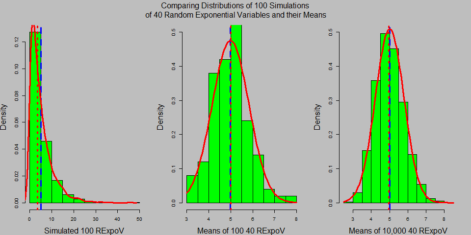
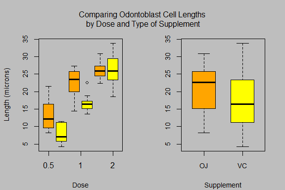

### My course project in the [Statistical Inference]("https://www.coursera.org/course/statinference")

#### Course Description

This repository contains my course project submitted through GitHub for the course [Statistical Inference]("https://www.coursera.org/course/statinference") in Coursera. This is the sixth course in the Johns Hopkins Data Science Specialization. The objective of the course is to teach the learner how to gather, clean, and manage data from a variety of sources using R.

### Course project requirement

In this course students will learn the fundamentals of statistical inference. Students will receive a broad overview of the goals, assumptions and modes of performing statistical inference. Students will be able to perform inferential tasks in highly targeted settings and will be able to use the skills developed as a roadmap for more complex inferential challenges.

There are two course project required for this course:

- The first project for this course requires the learner to demonstrate the Central Limit Theorem. The Central Limit Theorem (CLT) states that the distribution of averages of iid variables becomes that of a standard normal as the sample size increases, regardless of the underlying distribution. 

- The second project for this course gives the learner the opportunity to perform a basic exploratory and inferential analysis of the ToothGrowth data that comes with a standard R installation.The dataset ToothGrowth, contains a subset of the results from experiments conducted in the 1940's by EW Crampton of the Department of Nutrition, Macdonald College, McGill University, P.O., Prov. Quebec, Canada. The experiment assessed the effects of varying doses of Vitamin C on tooth growth in guinea pigs.

### Content 

This Repo contains the following:

- A ReadMe markdown document
- A Tooth.Rmd document
- A Tooth.md document
- A Tooth.docx microsoft word document
- A Tooth.html document
- A Tooth.pdf document
- A Tooth_files folder
- A CLT2.md markdown document
- A CLT2.html html document
- A index1.png file
- A index2.png file

The README markdown document is displayed by default by GitHub whenever you visit a GitHub repository. The document you are reading now is the README.md file. This README markdown document contains information about the content of this repo and instructions on how to use the content of this repo.

The Tooth.Rmd document contains my first course project for this course in R markdown format.

The Tooth.md document contains my first course project for this course in microsoft word format.

The Tooth.docx document contains my first course project for this course in microsoft word format.

The Tooth.html document contains my first course project for this course in html format. [My First Project in Statistical Inference](https://htmlpreview.github.io/?https://github.com/DocOfi/datasciencecoursera/Statistical_Inference/Tooth.html) 

The Tooth.pdf document contains my first course project for this course in adobe pdf format.

The Tooth_files folder contains the images dispalyed in the first course project.

The CLT2.md document contains my second course project for this course in markdown format. You can click on this file to view its content.

The CLT2.html document contains my second course project for this course in html format. If you want to view the CLT2.html file, click on this link [My Second Project in Statistical Inference](https://htmlpreview.github.io/?https://github.com/DocOfi/datasciencecoursera/Statistical_Inference/CLT2.html) 

The index1.png file contains the second image displayed in this README.md document.

The index2.png file contains the first image displayed in this README.md document.

To download the content of this repository as a .zip file, click on the Download ZIP button. If you have a GitHub account, you can fork the content so you'll have a copy on your GitHub account.  