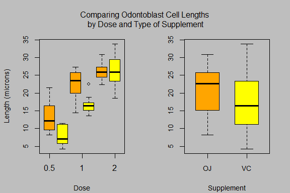

### My course project in the [Statistical Inference]("https://www.coursera.org/course/statinference")

#### Course Description

This folder contains my second course project submitted through GitHub for the course [Statistical Inference]("https://www.coursera.org/course/statinference") in Coursera. This is the sixth course in the Johns Hopkins Data Science Specialization. The objective of the course is to teach the learner how to gather, clean, and manage data from a variety of sources using R.

- The second project for this course gives the learner the opportunity to perform a basic exploratory and inferential analysis of the ToothGrowth data that comes with a standard R installation.The dataset ToothGrowth, contains a subset of the results from experiments conducted in the 1940's by EW Crampton of the Department of Nutrition, Macdonald College, McGill University, P.O., Prov. Quebec, Canada. The experiment assessed the effects of varying doses of Vitamin C on tooth growth in guinea pigs.

### Content 

This Repo contains the following:

- A ReadMe markdown document
- A Tooth.Rmd document
- A Tooth.md document
- A Tooth.docx documen
- A Tooth.pdf document
- A Tooth.html document
- A index2.png file

The README markdown document is displayed by default by GitHub whenever you visit a GitHub page. The document you are reading now is the README.md file. This README markdown document contains information about the content of this repo and instructions on how to use the content of this repo.

The Central_Limit_Theorem folder contains my first course project for this course.

The Tooth.Rmd document contains my second course project for this course in R markdown format.

The Tooth.md document contains my second course project for this course in markdown format.

The Tooth.docx document contains my second course project for this course in microsoft word format.

The Tooth.pdf document contains my second course project for this course in adobe pdf format.

The Tooth.html document contains my second course project for this course in html format.

The index2.png file contains the first image displayed in this README.md document.

 